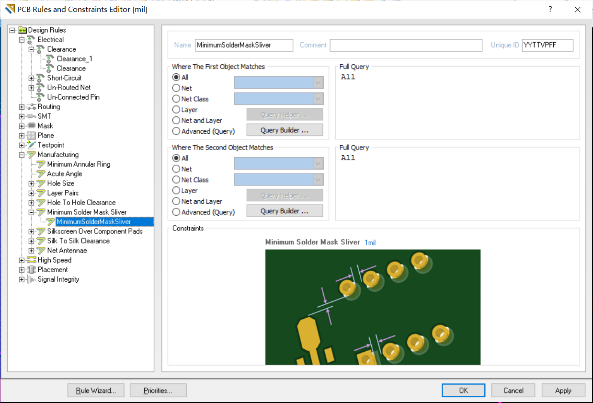
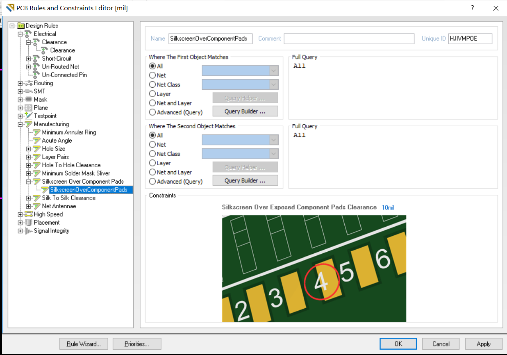
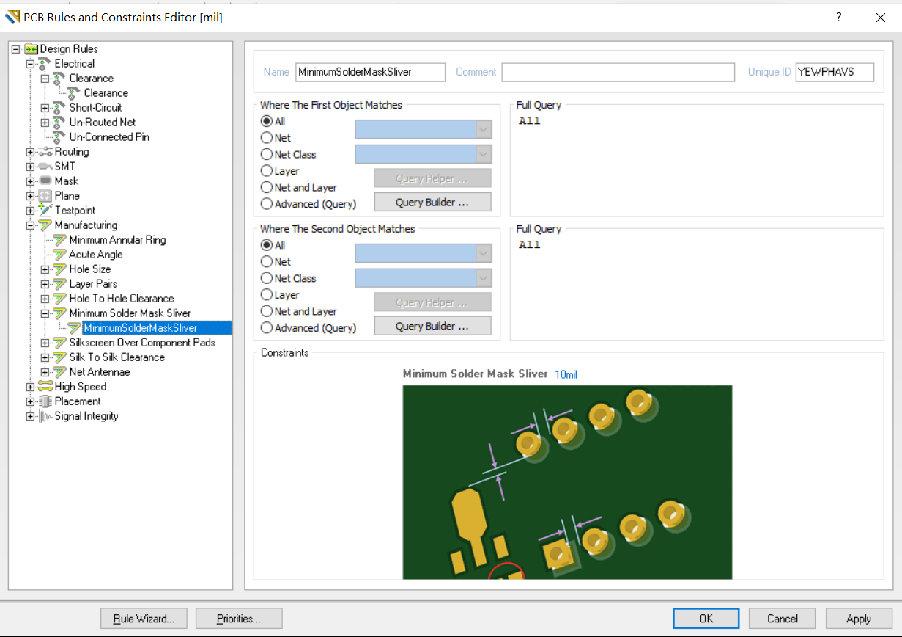

### AD09报错解决方法

运行环境：windows，软件 ad09

当画好原理图后，使用pcb建立向导，建立好pcb项目后，若出现元器件为绿色的情况，但检查后发现无误则可以直接使用快捷键，`T+M`即可开始布线

在布好线之后，使用tools —>design rule check，检查，若出现以下问题，解决方法为：

#### [Clearance Constraint Violation]

报错：焊盘间相隔太近，不满足规则

解决办法：design ->tools

找到图中所示的子选项，将constrains选项中的数值改为合适大小，适合焊盘大小。

我的工程中的是一个2N3904三极管，封装为TO-92A,默认规则中的数值为10mils则会报错。

#### [Silkscreen Over Component Pads Constraint Violation]

报错:个是[丝印](https://www.baidu.com/s?wd=丝印&tn=SE_PcZhidaonwhc_ngpagmjz&rsv_dl=gh_pc_zhidao)（silkscreen）与[焊盘](https://www.baidu.com/s?wd=焊盘&tn=SE_PcZhidaonwhc_ngpagmjz&rsv_dl=gh_pc_zhidao)间距小于规则的。自动布线不会解决这样的错误。
尝试手动修改[丝印](https://www.baidu.com/s?wd=丝印&tn=SE_PcZhidaonwhc_ngpagmjz&rsv_dl=gh_pc_zhidao)或[焊盘](https://www.baidu.com/s?wd=焊盘&tn=SE_PcZhidaonwhc_ngpagmjz&rsv_dl=gh_pc_zhidao)的位置，[错误链接](https://www.baidu.com/s?wd=错误链接&tn=SE_PcZhidaonwhc_ngpagmjz&rsv_dl=gh_pc_zhidao)可以直接找到错误坐标位置～

方法二：

找到如图的子选项，并修改参数

#### [Minimum Solder Mask Sliver Constraint Violation]

报错：最小阻焊间隙违反规则，小于10mil

