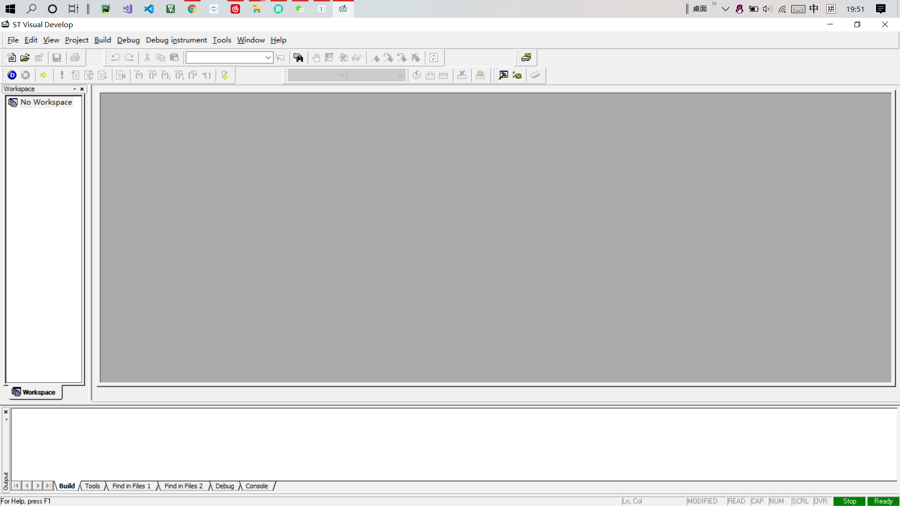
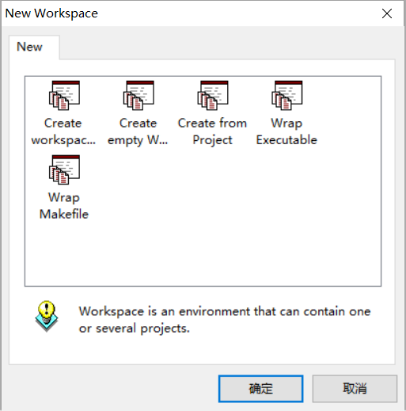
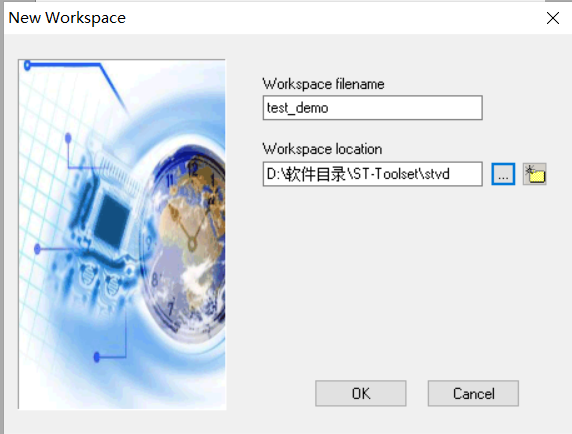
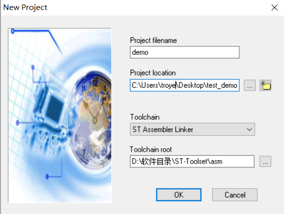
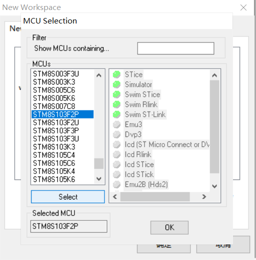
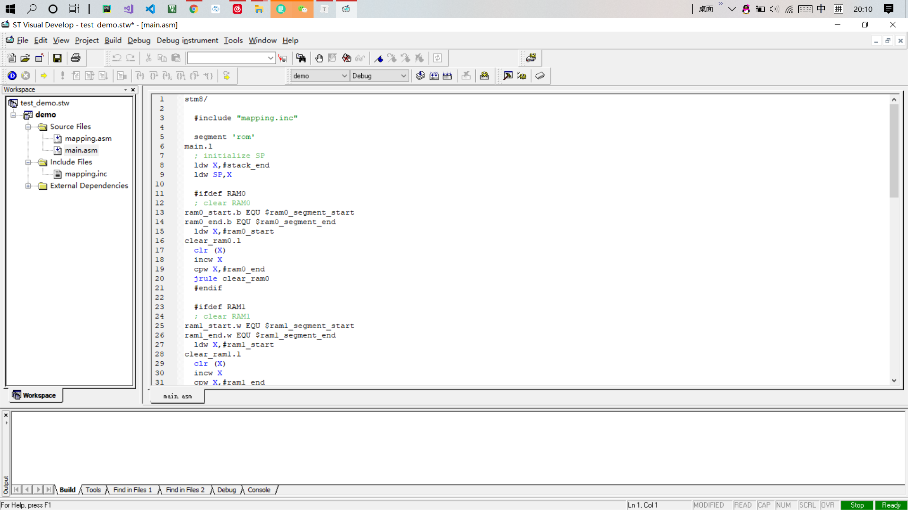
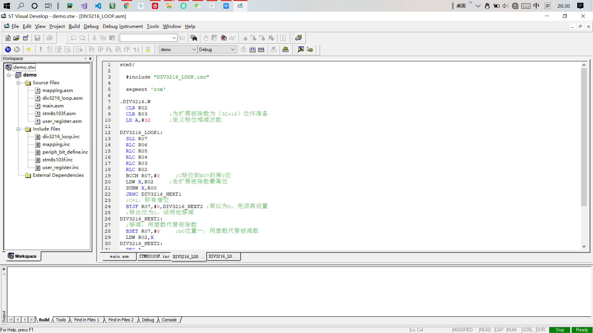

## STVD汇编开发stm8

使用软件为stvd4.3.9版

#### 建立工程

step1:新建项目

（图一为打开软件的界面）

新建一个文件夹来存放项目，file -> new workspace，点击Creat workspace并确定

输入项目名字和存放路径

填好项目名字，选择Toolchain为汇编（ST Assembler Linker）

选择好芯片型号，一定要按select确定，或者双击该芯片型号，点击ok

即创建工程完成，下图为刚创建好的界面

step2：添加文件

其中stvd的汇编文件后缀名为.asm（类似于cpp文件）,说明文件的后缀名为.inc（类似于头文件）.。在主程序用需要include。

添加方法：右键文件夹名，add file to floder，将需要的文件添加。

问题说明：

使用模块化编程时，如需要调用.asm中的标号需要，再定义一个inc文件

