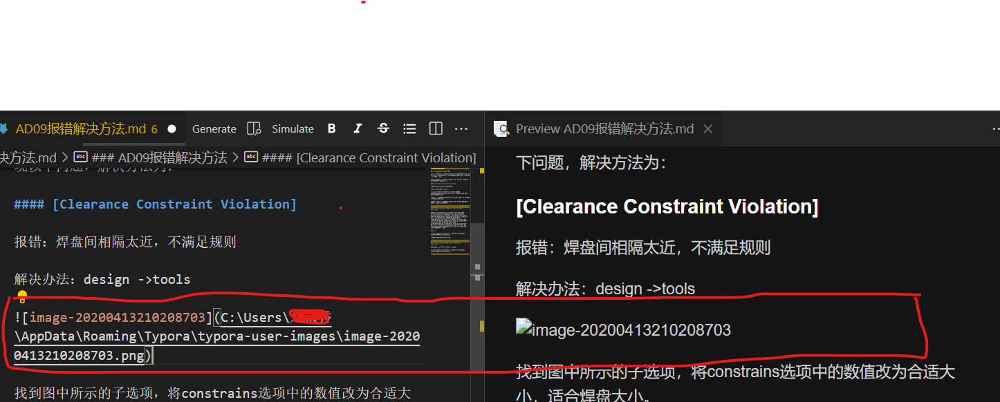

#### markdown的迁移
* 问题背景 

由于将笔记迁移至新电脑所以笔记缺少图片文件所以在预览中无法显示出图片，如下图所示。

所以根据显示的文件路径前往原电脑中拷贝相应的图片文件夹，但是有了图片文件夹并且更换绝对路径后，仍然没有反应。  

---

* 解决方案 

查阅后得至vs code 需要使用相对路径才可以使用图片
故使用全局替换具体操作为：在需要操作的所有文件的根目录中使用```ctrl+F``` 来进行查找与替换，并将markdown文件中的``` ../typora-user-images/ ```替换为```../typora-user-images/```相对路径。从而可以加载出图片。

上述为加载出本地图片的方法，现在还有使用网络连接的图片，需要对vscode进行设置更改。
```ctrl+shift+p ```打开设置，输入```markdown 预览设置```将选项更改为如下图所示：


* 建议
使用相对路径保存图片，迁移时将图片文件夹一并迁移
或者使用图床