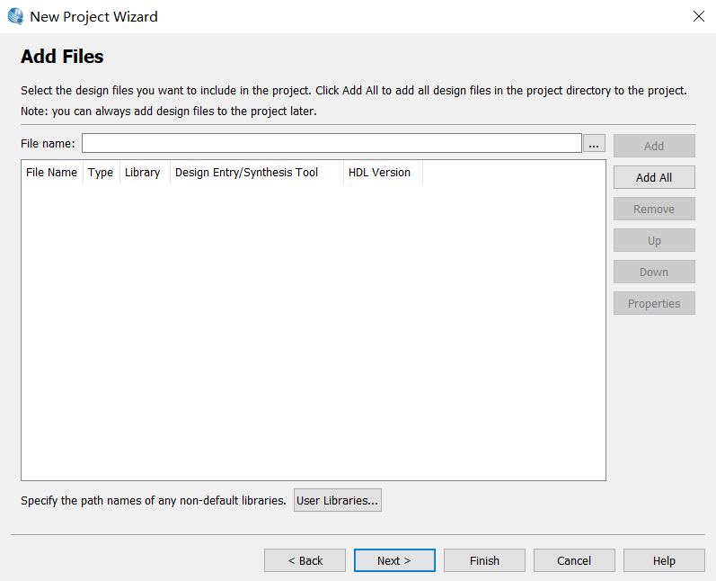

## 解决quartus Ⅱ 14版本无法仿真的问题

如果熟悉quartusⅡ 的使用可以自行跳过这部分

----------------------------------------------------

#### 新建工程

file -> new project wizard...

-> 点击next

在第一行选择好项目放在的文件夹，第二行命名项目名

-> 直接点击next

选择好芯片及各项参数，-> next

将仿真simulation改为none，点击next

最后直接finish即可

### 将vhdl代码编写好

file -> new -> VHDL File

将vhdl代码写好后 satrt complicate编译

在编译没问题后即可进行仿真

------------------------------------

### 仿真

file -> new -> UNiversity Program VWF

创建一个仿真文件

再双击左侧空白栏的位置

点击Node Finder，再点击list

 

再将左侧的nodes全部加入右侧中

将输入的信号选择好后，点击下图按钮进行仿真

此时若只破解了quartus2则无法进行仿真，将会报错

***Failure to obtain a Verilog simulation license. Unable to checkout any of these license features: alteramtivsim or alteramtivlog.***

**报错原因**为只对quartus进行了破解，而集成的仿真工具modelsim-altera并没有破解

-------------------------------------------

#### 破解方法

破解需要下载如下的文件（ps：普通的modelsim破解软件包中会有这两个文件）

找到quartus的安装路径，

在文件夹中打开，modelsim_ase然后，打开win32aloem

将两个破解需要的文件，复制到该目录中，然后运行（双击即可）patch_dll.dat文件，将会生成一个.txt文件LICENSE.TXT将其另存为刚刚的win32aloem目录中，再将该文件加入到环境变量中

右键点击我的电脑，点击属性》高级系统设置》高级》环境变量》新建，新建变量名为：MGLS_LICENSE_FILE，变量值为：（“license.txt”所在的目录，可以自行修改）

----------------------------

以上即为破解方法，破解完后，再返回quartus中开始仿真，即可得到仿真波形

还有一个小问题，当关闭已经写好的项目后，如果下次要修改代码，打开quartus时不能只打开vdh文件，需要把项目工程打开，即打开后缀为.sqf的文件。