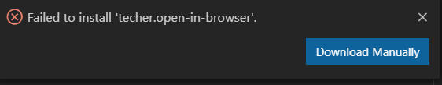

### HTML 

使用vs code编写html方法：


若直接安装**失败**（如下图），则选择在浏览器中安装，



将该下载的插件移动至包含html代码的文件夹，再双击安装插件，即可安装成功


使用快捷键<kbd>alt</kbd>+<kbd>b</kbd>可在游览器中显示，或者在浏览器中输入html文件的绝对路径


#### 第一个html文件

```html
<!DOCTYPE HTML>
<html>
    <body>
        <h1>我的第一个标题</h1>
        <p>我的第一个段落</p>
        
        </body>>
        </html>>

```


#### HTML标题

标题通过<h1>-<h6>等标签定义

```html
<html>

<body>

<h1>This is heading 1</h1>
<h2>This is heading 2</h2>
<h3>This is heading 3</h3>
<h4>This is heading 4</h4>
<h5>This is heading 5</h5>
<h6>This is heading 6</h6>
    
</body>
</html>
```


#### HTML段落

HTML段落通过标签<p>定义

```html
<html>
<body>
<p>这是段落。</p>
<p>这是段落。</p>
<p>这是段落。</p>
</body>
</html>
```


####  HTML链接

HTML链接通过<a>定义


```html
<html>
<body>

<a href="http://www.w3school.com.cn">
This is a link</a>

</body>
</html>

```


#### HTML图像

HTML 图像是通过  标签进行定义的。


```html
<html>
<body>


</body>
</html>
```

--------------------------

**HTML 文档是由 HTML 元素定义的。**

HTML 元素指的是从开始标签（start tag）到结束标签（end tag）的所有代码。

--------------


#### HTML 元素语法

- HTML 元素以*开始标签*起始
- HTML 元素以*结束标签*终止
- *元素的内容*是开始标签与结束标签之间的内容
- 某些 HTML 元素具有*空内容（empty content）*
- 空元素*在开始标签中进行关闭*（以开始标签的结束而结束）
- 大多数 HTML 元素可拥有*属性*


和php语言一样可在其中嵌套HTML元素

HTML文档由嵌套的HTML元素构成


### HTML 属性

HTML 标签可以拥有*属性*。属性提供了有关 HTML 元素的*更多的信息*。

属性总是以**名称/值对**的形式出现，比如：*name="value"*。

**属性总是在 HTML 元素的*开始标签*中规定**


属性的例子：

```html
<html>
<body bgcolor="pink">

<a href="http://www.w3school.com.cn">
This is a link</a>

<h1 align="center">This is heading 1</h1>

    
</body>
</html>

```

一般来说html的属性有

| 属性  | 值                 | 描述                                     |
| ----- | ------------------ | ---------------------------------------- |
| class | *classname*        | 规定元素的类名（classname）              |
| id    | *id*               | 规定元素的唯一 id                        |
| style | *style_definition* | 规定元素的行内样式（inline style）       |
| title | *text*             | 规定元素的额外信息（可在工具提示中显示） |

[HTML标准属性](https://www.w3school.com.cn/tags/html_ref_standardattributes.asp)


#### HTML水平线

<hr /> 标签在 HTML 页面中创建水平线。
hr 元素可用于分隔内容。

```html
<html>

<body>
<p>hr 标签定义水平线：</p>
<hr />
<p>这是段落。</p>
<hr />
<p>这是段落。</p>
<hr />
<p>这是段落。</p>
</body>
</html>

```


**style**属性用于改变HTML元素的样式

```html
<html>
<body style="background-color:PowderBlue;">

<h1>Look! Styles and colors</h1>

<p style="font-family:verdana;color:red">
This text is in Verdana and red</p>

<p style="font-family:times;color:green">
This text is in Times and green</p>

<p style="font-size:30px">This text is 30 pixels high</p>

</body>
</html>
```


在新的html中，有若干的标签和属性是被废弃的，应该在代码中避免使用这些被废弃的标签和属性。

| 标签/属性            | 描述               |
| -------------------- | ------------------ |
| <center>             | 定义居中的内容。   |
| <font> 和 <basefont> | 定义 HTML 字体。   |
| <s> 和 <strike>      | 定义删除线文本     |
| <u>                  | 定义下划线文本     |
| align                | 定义文本的对齐方式 |
| bgcolor              | 定义背景颜色       |
| color                | 定义文本颜色       |

**！！！以上标签不使用**


#### HTML样式-背景颜色

background-color 属性为元素定义了背景颜色

```html
<html>

<body style="background-color:yellow">
<h2 style="background-color:red">This is a heading</h2>
<p style="background-color:green">This is a paragraph.</p>
</body>

</html>
```

style 属性淘汰了“旧的” bgcolor 属性。

------


#### HTML样式实例 - 字体、颜色和尺寸

font-family、color 以及 font-size 属性分别定义元素中文本的字体系列、颜色和字体尺寸：

```html
<html>

<body>
<h1 style="font-family:verdana">A heading</h1>
<p style="font-family:arial;color:red;font-size:20px;">A paragraph.</p>
</body>

</html>
```

style 属性淘汰了旧的 <font> 标签。

------

#### HTML 样式实例 - 文本对齐

text-align 属性规定了元素中文本的水平对齐方式：

```html
<html>

<body>
<h1 style="text-align:center">This is a heading</h1>
<p>The heading above is aligned to the center of this page.</p>
</body>

</html>
```

style 属性淘汰了旧的 "align" 属性。

-------

