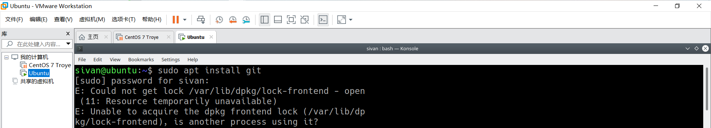

## 使用apt安装时的报错

error：Unable to acquire the dpkg frontend lock 如下图



错因：当apt在安装时未完成退出，在Ubuntu系统终端下，用apt-get install 安装软件的时候，如果在未完成下载的情况下将终端强行关闭。此时 apt-get进程可能没有结束。结果，如果再次运行apt-get install 命令安装软件时，出现如上错误。即有另一个程序正在占用apt-get install进程，由于它在运行时，会占用软件源更新时的系统锁（简称‘系统更新锁’），此时资源被锁。

，**第一种方法**，我们只需要杀死之前的进程，释放系统锁就可以了：


```
sivan@ubuntu:~$ ps aux | grep -i apt
sivan    30112  0.0  0.0   5300   844 pts/1    S+   22:06   0:00 grep --color=auto -i apt
sivan@ubuntu:~$ sudo kill 5300                                             
[sudo] password for sivan:
```


**第二种方法，强制解锁**

```
linuxidc@linuxidc:~$ sudo rm /var/cache/apt/archives/lock
[sudo] linuxidc 的密码：
linuxidc@linuxidc:~$ sudo rm /var/lib/dpkg/lock
```

