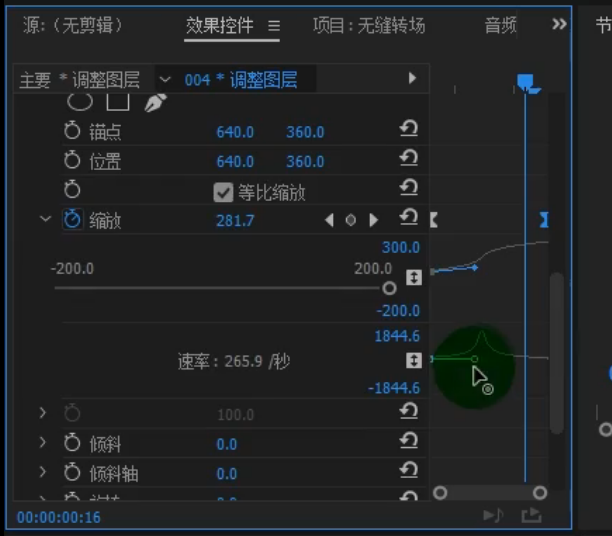

## pr

#### 关于pr的时间码的解释 **00:00:00:00**

第一段：00为小时，第二段00代表分钟 第三段00代表秒，第四段00代表每秒的帧数，如果视频为每秒25帧的话，那么在最后一段到达25即会在第三段加一。

#### 使用pr来运行无缝拉镜转场--放大缩小

* 步骤一： 先建立一个五帧的调整图层一，再建立一个十帧的调整图层二，发布别放在轨道三和轨道二，如图所示，

* 步骤二：在效果中搜索，复制，添加到调整图层一，将计数值改为3，及复制九份，如图所示

* 步骤三：在效果中搜索镜像，调价到调整图层一，并```ctrl+c```，```ctrl+v```复制三份。如图

* 

并依次将反射角度改为90°，-90°，180°，360°，并且对90和-90修改他们的y坐标，及反射中心的后面一个参数，对180和360修改他们的x坐标，即反射中心的第一个参数，（ps：当修改完反射角度按下回车时，可能会出现黑屏，这是不是视频不见了，继续调节对应的x，y坐标即可），调节至出现的九个视频的边框刚好消失时，即可。

* 步骤四：设置贝塞尔曲线，在效果中搜索扭曲，加入到第三轨道即调整图层二中，如图在变换中


点击缩放前面的小闹钟，将参数值改为300即再创建一个300的关键帧，再将两个关键帧设置为贝塞尔曲线，100->300


再将曲线设置为先快后慢即为放大转场，如图



* 步骤五：将使用合成的快门角度取消勾选，并将快门角度设置为360°


以上即为放大转场的制作过程了。


##### 缩小的转场

将关键帧设置为300->100即可，其他可粘贴复制。


#### 消除噪音的方法

方法一：效果中搜索denosier

然后再效果面板中调整


方法二：在音频中调整


切换到音频剪辑后，在减少杂色调节参数，以及降低隆隆声

[降噪教程](https://www.bilibili.com/video/av49841427/)