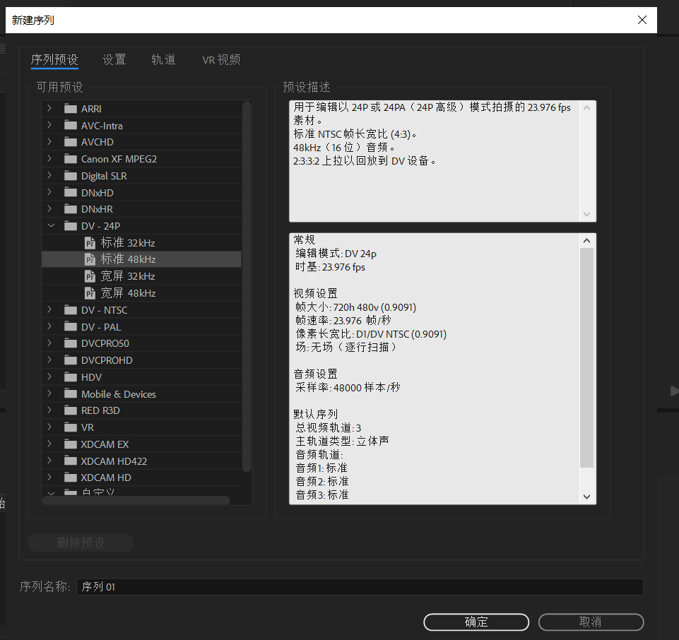
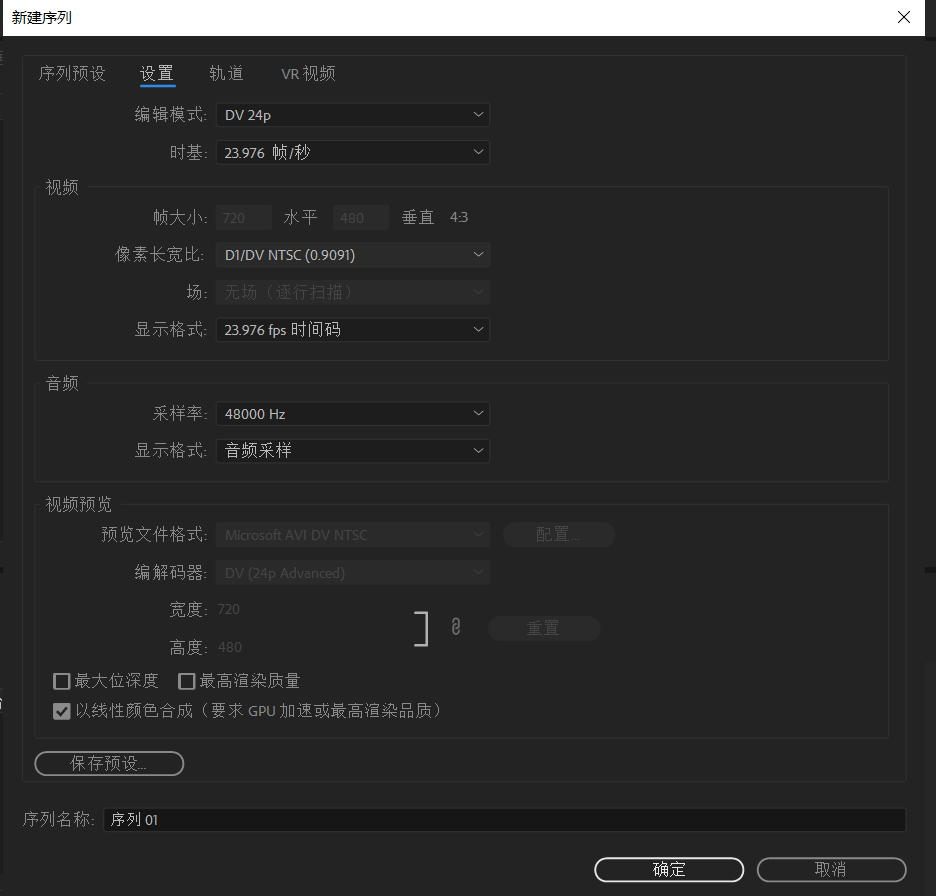
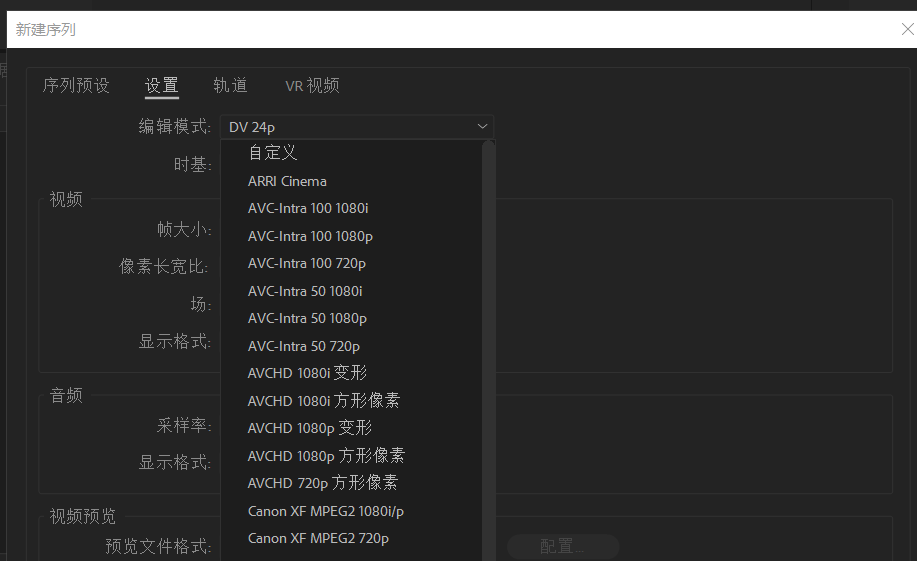
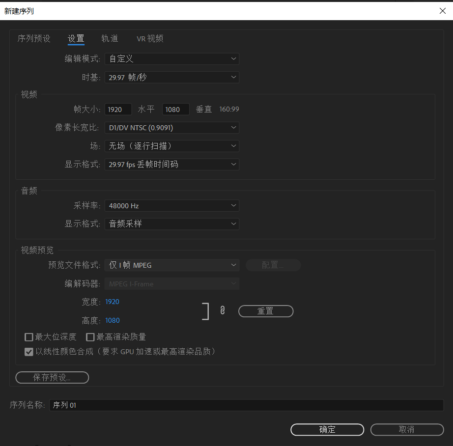
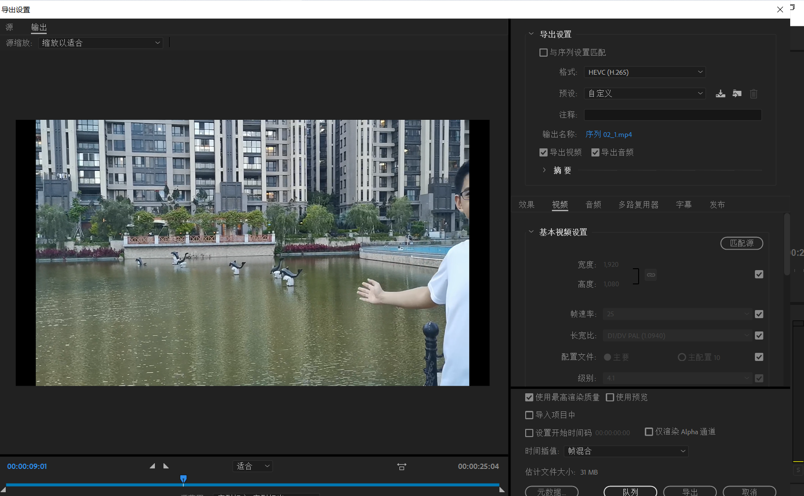
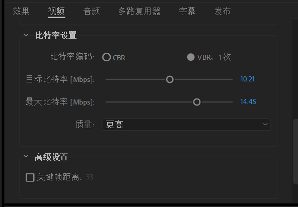

### pr解决视频不清晰的方法

首先在新建序列的时候如果不新建序列，直接将素材导入并拉到时间轴的话，

可以看到视频的分辨率为720p，故倒是导出的时候设置为1080p则会显得很模糊。

此时我们需要自定义序列的参数

在第一行下拉选择自定义，接着修改相关参数，

接着可以将该设置保存预设，方便以后直接使用。

#### 导出的设置

注意导出的时候也需要看相应的设置。

首先时视频输出的高度和宽度，电脑全屏为1920*1080，帧速率为25或者29.97，长宽比如图，目标比特率十左右，最大比特率十几，比特率越大视频的大小也越大。