# Scrapy爬虫框架

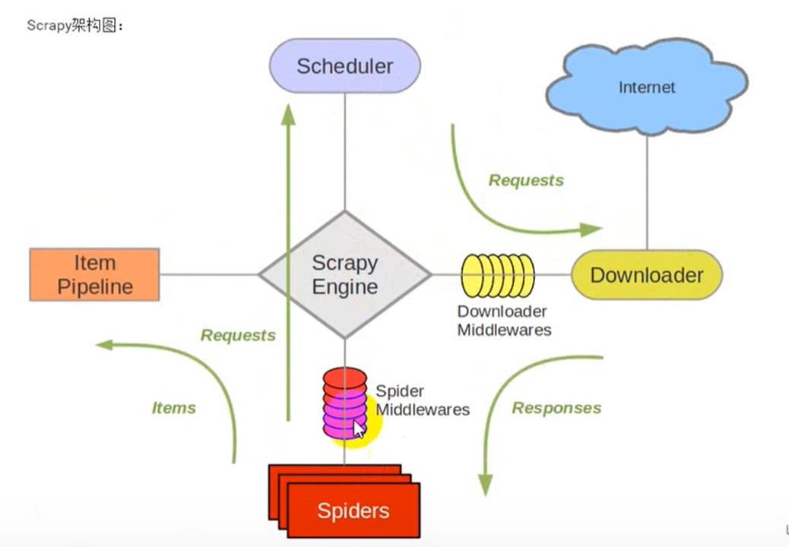

使用前需要，安装scrapy库

方法一：使用pip安装，如果是最新的pip的话，只需要先安装twisted，及使用命令pip install twisted，再pip intsall scrapy即可

方法二：直接在pycharm中安装


创建一个scrapy框架，常用startproject、genspider、crawl

```
scrapy startproject + 文件名
```

```
scrapy genspider + 爬虫名 + 爬取域名（填写顶级域名即可）  
新建爬虫的时候必须在项目所在的文件创建
```

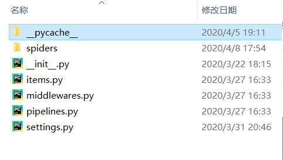

```
scrapy crawl + 爬虫名
```


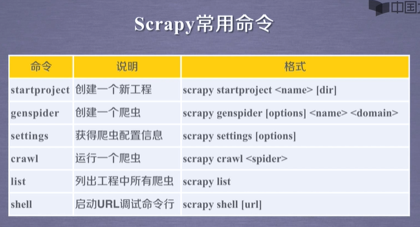


#### 创建一个工程

使用命令```scrapy  startproject + 项目名```

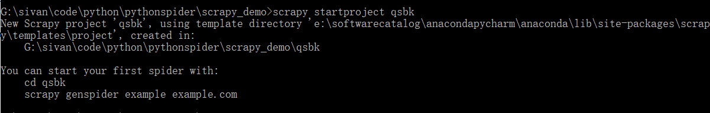

接着就能在该目录下看到以下文件


#### 创建一个爬虫

使用命令```scrapy genspider + 爬虫名 + 顶级域名```

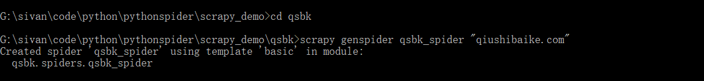

**注意**：必须打开项目文件夹创建爬虫。

---------------------------------------------------


#### 使用pipline来处理数据

方法一：
```python
class QsbkPipeline(object):
    def __init__(self):
        self.fp = open("duanzi.json",'w',encoding = 'utf-8')
    def open_spider(self,spider):
        print("爬虫开始")

    def process_item(self, item, spider):
        item_json = json.dumps(dict(item),ensure_ascii = False)      #将编码方式不为ascII码方式，可以保存中文
        self.fp.write(item_json + "\n")
        return item

    def close_spider(self,spider):
        self.fp.close()
        print("爬虫结束")
```

##### JsonItemExporter和JsonLinesItemExporter：
保存json数据的时候， 可以使用这两个类，让操作变得得更简单。

1. JsonItemExporter：这个是每次把数据添加到内存中。最后统一写入到磁盘中。好处

是， 存储的数据是一个满足json规则的数据。坏处是如果数据量比较大， 那么比较耗内存示例代码如下：

```python
from scrapy.exporters import JsonItemExporter
class QsbkPipeline(object):
    def __init__(self):
        self.fp = open("duanzi.json",'wb')
        self.exporter = JsonItemExporter(self.fp,ensure_ascii = False,encoding = 'utf-8')
        self.exporter.start_exporting()

    def open_spider(self,spider):
        print("爬虫开始")

    def process_item(self, item, spider):
        self.exporter.export_item(item)
        return item

    def close_spider(self,spider):
        self.exporter.finish_exporting()
        print("爬虫结束")
```


2. JsonLinesItemExporter：这个是每次调用export_item的时候就把这个item存储到

硬盘中。坏处是每一个字典是一行， 整个文件不是一个满足json格式的文件。好处是每次

I处理数据的时候就直接存储到了硬盘中，这样不会耗内存，数据也比较安全。

```python
#方法三：与方法一的结果一样
from scrapy.exporters import JsonLinesItemExporter
class QsbkPipeline(object):
    def __init__(self):
        self.fp = open("duanzi.json",'wb')
        self.exporter = JsonLinesItemExporter(self.fp,ensure_ascii = False,encoding = 'utf-8')

    def open_spider(self,spider):
        print("爬虫开始")

    def process_item(self, item, spider):
        self.exporter.export_item(item)
        return item

    def close_spider(self,spider):
        print("爬虫结束")
```

<font color = 'red'>在使用pipline下载时，务必要在setting中将pipline的设置打开，否则无法使用pipkine下载。</font>

----------------

#### 在pycharm中直接运行，不使用命令行运行

除了使用命令行运行爬虫scrapy crawl + 爬虫名，还可以编写一个py文件在pycharm中直接运行

* step1：在根目录创建一个py文件

* step2： 代码为

* ```
  from scrapy import cmdline
  
  cmdline.execute("scrapy crawl bilibili".split())
  ```

  split将命令行的指令修改为列表

  然后就可以运行该文件从而执行名为bilibili的爬虫

---------------------------------


#### 爬取多个界面的的方法

使用scrapy库中的request方法

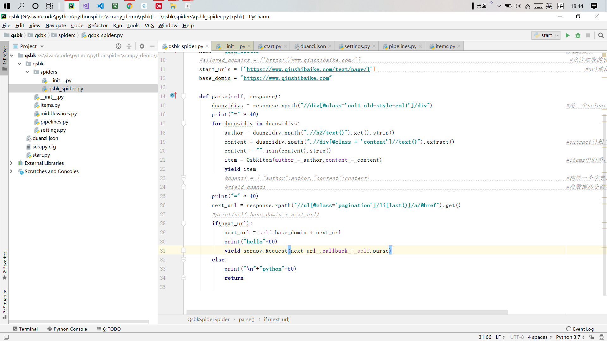

```python
    def parse(self, response):
        duanzidivs = response.xpath("//div[@class='col1 old-style-col1']/div")                                          #是一个selectlist
        print("=" * 40)
        for duanzidiv in duanzidivs:
            author = duanzidiv.xpath(".//h2/text()").get().strip()
            content = duanzidiv.xpath(".//div[@class = 'content']//text()").extract()                                   #extract()相当于getall()
            content = "".join(content).strip()
            item = QsbkItem(author = author,content = content)                                                          #items中的类，通过封装为一个类传递数据，推荐做法
            yield item
            #duanzi = { "author":author,"content":content}                                                              #构造一个字典，键值对为author，content
            #yield duanzi                                                                                               #将数据移交给引擎
        print("=" * 40)
        next_url = response.xpath("//ul[@class='pagination']/li[last()]/a/@href").get()
        #print(self.base_domin + next_url)
        if(next_url):
            next_url = self.base_domin + next_url
            print("hello"*60)
            yield scrapy.Request(next_url ,callback = self.parse)
        else:
            print("\n"+"python"*50)
            return
```

当网页有规律编排时，多页爬取时只需要爬取到下一页的url并作为参数传给request函数即可，callback方法调用prase类似于递归。并且在setting.py中将下载速度设置一个延时可以为1s，避免爬取速度过快使得网站的服务器负载过重，也避免了因为速度过快被识别为爬虫

注意事项：当直接使用时可能会出现下面的问题：


此时可以直接将allow_domin注释掉，暴力方法，目前没发现其他解决办法，哈哈哈哈哈

-------------------------


### CrawlSpider的使用

创建一个crawlpider项目

项目创建

```
scrapy  startproject + 项目名
```

crawlspider爬虫创建

```
scrapy genspider -t crawl 爬虫名 顶级域名
```

与普通爬虫不同的是，crawlspider继承自CrawlSpider类，新增了一个规则


##### <font color='blue'>LinkExtractors链接提取器</font>：

使用LinkExtractors可以不用程序员自己提取想要的url， 然后发送请求。这些工作都可以交给Link Extractors， 他会在所有爬的页面中找到满足规则的url， 实现自动的爬取。以下对Link Extractors类做一个简单的介绍：

```
class scrap y.link extractors.Link Extractor(

allow=() ，

deny=() ，

allow_domains=() ，

deny_domains=() ，

deny_extensions=None，

restrict_x paths=() ，

tags=(*a'， 'area') ，

attrs=('href') ，

canonicalize=True，

unique=True，

process_value-None
```


主要参数讲解：


allow：允许的url。所有满足这个正则表达式的url都会被提取。

deny：禁止的url。所有满足这个正则表达式的url都不会被提取。

allow_domains：允许的域名。只有在这个里面指定的域名的url才会被提取。

deny_domains：禁止的域名。所有在这个里面指定的域名的url都不会被提取。

restrict_xpaths：严格的xpath。和allow共同过滤链接。


##### <font color = 'blue'>Rule规则类：</font>

定义爬虫的规则类。以下对这个类做一个简单的介绍：

```
class scrapy.spiders.Rule(

link_extractor，

call bact=None，

cb_kwargs=None，

follow=None，

process_links=None，

process_request=None

)
```


主要数讲解：


link_extractor：一个Link Extractor对象， 用于定义爬取规则。


callback：满足这个规则的url， 应该要执行哪个回调函数。因为crawl Spider使用了parse作为回调函数， 因此不要覆盖parse作为回调函数自己的回调函数。

follow：指定根据该规则从response中提取的链接是否需要跟进。


process_links：从link_extractor中获取到链接后会传递给这个函数用来过滤不需要爬取的链接。


例子：使用crawlspider爬取小程序社区

```
# -*- coding: utf-8 -*-
import scrapy
from scrapy.linkextractors import LinkExtractor
from scrapy.spiders import CrawlSpider, Rule
from wxapp.items import WxappItem

class WxappSpiderSpider(CrawlSpider):
    name = 'wxapp_spider'
    allowed_domains = ['wxapp-union.com']
    start_urls = ['http://www.wxapp-union.com/portal.php?mod=list&catid=2&page=1']

    rules = (
        Rule(LinkExtractor(allow=r'.+mod=list&catid=2&page=\d'),  follow=True),   #寻找文章的url地址规则，因为只需要找到url
        Rule(LinkExtractor(allow=r'.+article-.+\.html'), callback='parse_detail', follow=False)   #只需要当前页面的内容，而不需要提到的url故，follow赋值为False
    )

    def parse_detail(self, response):
        title = response.xpath("//h1[@class='ph']/text()").get()
        author_m = response.xpath("//p[@class='authors']")
        author = author_m.xpath(".//a/text()").get()
        time = author_m.xpath(".//span/text()").get()
        content = response.xpath("//td[@id = 'article_content']//text()").getall()
        content = "".join(content).strip()
        item = WxappItem(title=title,author = author, time= time , content=content)
        yield item
```

其他部分代码与之前的例子相同

---------------------------------

#### scrapy spell的使用

在需要即使运行一些代码是，避免scrapy整个框架笨重的运行，可以直接使用spell，也可以导入一些第三方库，例如beautifulsoup等

-----------------------------------

Request对象在我们写爬虫， 爬取一页的数据需要重新发送一个请求的时候调用。这个类需要传递一些参数， 其中比较常用的参数

有：

1.url：这个request对象发送请求的url。

2.callback：在下载器下载完相应的数据后执行的回调函数。

3.method：请求的方法。默认为GET方法， 可以设置为其他方法。

4.headers：请求头， 对于一些固定的设置， 放在settings.py中指定就可以了。对于那些非固定的， 可以在发送请求的时候指定。

5.meta：比较常用。用于在不同的请求之间传递数据用的。

6.encoding：编码。默认的为utf-8， 使用默认的就可以了。

7.dot_filterⅠ表示不由调度器过滤。在执行多次重复的请求的时候用得比较多。

8.errback：在发生错误的时候执行的函数。


Response对象：

Response对象一般是由Scrap y给你自动构建的。因此开发	者不需要关心如何创建Response对象， 而是如何使用他。	Response对
象有很多属性，可以用来提取数据的。主要有以下属性：		

1.meta：从其他请求传过来的meta属性， 可以用来保持多	个请求之间的数据连接。	

2.encoding：返回当前字符串编码和解码的格式。		

3.text：将返回来的数据作为unicode字符串返回。		

4.body：将返回来的数据作为bytes字符串返回。		

5.xpath：xapth选择器。		

6.css：css选择器。		

-------------------------------------------------

#### 使用Post请求进行登陆

#### 当出现Crawled (200) <GET https://car.autohome.com.cn/pic/series/65.html> (referer: None)时

若xpath返回没有数据，检查是否xpath路径写错了，或者机器人协议没关闭

---------------------------------------

#### 使用scrapy下载网站图片

示例下载汽车之家中的宝马汽车图片：[网站地址](https://car.autohome.com.cn/pic/series/65.html#pvareaid=2042210),并且按照不同的标题存放在不同的文件夹中


方法一：使用传统的request中的urlretrieve，遍历图片的url然后下载；

bwm5.py

```pthon
# -*- coding: utf-8 -*-
import scrapy
from bwm.items import BwmItem

class Bwm5Spider(scrapy.Spider):
    name = 'bwm5'
    allowed_domains = ['car.autohome.com.cn']
    start_urls = ['https://car.autohome.com.cn/pic/series/65.html']

    def parse(self, response):
        uiboxs = response.xpath("//div[@class='uibox']")[1:]            #提取界面中的所有带unibox属性的标签，并且切片，从第二个标签开始提取
        for uibox in uiboxs:
            category = uibox.xpath(".//div[@class = 'uibox-title']/a/text()").get()          #获取所有照片的名字
            urls = uibox.xpath(".//ul/li/a/img/@src").getall()                              #获取所有图片的url地址
            #标签中之获得的是不完整的url，少了开头hrttp：，故需要拼接成可用的url
            #方法一：
            # for url in urls:
            #     url = "http:" +url
            #     print(url)

            #方法二:若在response下，可以使用urljoin方法来拼接处完整的url
            # for url in urls:
            #     url = response.urljoin(url)
            #     print(url)

            #方法三：
            urls = list(map(lambda url:response.urljoin(url),urls))
            print(urls)

            Item = BwmItem(category = category,urls = urls)
            yield Item
```

item.py

```python
# -*- coding: utf-8 -*-

# Define here the models for your scraped items
#
# See documentation in:
# https://docs.scrapy.org/en/latest/topics/items.html

import scrapy


class BwmItem(scrapy.Item):
    # define the fields for your item here like:
    # name = scrapy.Field()
    category = scrapy.Field()
    urls = scrapy.Field()
```


pipline.py

```python
# -*- coding: utf-8 -*-

# Define your item pipelines here
#
# Don't forget to add your pipeline to the ITEM_PIPELINES setting
# See: https://docs.scrapy.org/en/latest/topics/item-pipeline.html
import os
from urllib import request
class BwmPipeline(object):
    def __init__(self):
        self.path = os.path.join(os.path.dirname(os.path.dirname(__file__)),"image")
        if not os.path.exists(self.path):
            os.mkdir(self.path)                                                                                         #判断是否存在image文件夹
    def process_item(self, item, spider):
        category = item['category']
        urls = item['urls']
        category_path = os.path.join(self.path,category)
        if not os.path.exists(category_path):
            os.mkdir(category_path)
        for url in urls:
            img_name = url.split('_')[-1]                                                                               #将url地址的后面被_符号分割的部分作为图片名字
            request.urlretrieve(url,os.path.join(category_path,img_name))                                               #使用request请求下载图片，urlretrieve下载函数
        return item
#以上为传统方法，确定是需要按列表一个一个下载图片，下载速度较慢
```


-------------------------------------

方法二：使用scrapy内置的pipline专门的图片文件下载来下载；

为什么要选择使用scrapy内置的下载文件的方法：				

1.避免重新下载最近已经下载过的文件。

2.可以方便的指定文件存储的路径。

3.可以将下载的图片转换成通用的格式。比如png或jpg。

4.可以方便的生成缩略图。

5.可以方便的检测图片的宽和高，确保他们满足最小限制。

6.异步下载，效率非常高。


##### 下载文件的FilesPipeline	：


当使用Files Pipeline下载文件的时候， 按照以下步骤来完成：

1.定义好一个Item， 然后在这个item中定义两个属性， 分别为file_urls以及files。	file

url链接， 需要给一个列表。

2.当文件下载完成后， 会把文件下载的相关信息存储到item的files属性中。比如下载路径、下载的url和文件的校验码等。

3.在配置文件settings.py中配置FILES_STORE， 这个配置是用来设置文件下载下来的路径。

4.启动pipeline：在ITEM_PIPELINES中设置scrapy.pipelines.files.FilesPipeline：1。


##### 下载图片的ImagesPipeline：
当使用Images Pipeline下载文件的时候， 按照以下步骤完成：
1.定义好一个Item， 然后在这个item中定义两个属性，分别为image_urls以及images。images_urls是用来存储需要下载的图片的url链接，需要给一个列表。

2.当文件下载完成后， 会把文件下载的相关信息存储到items的images属性中。如下载路径、下载的url和图片的校验码等。

3.在配置文件settings.py中配置IMAGES_STORE， 这个配置是用来设置图片下载的路径。

4.启动pipeline：在IT EN_PIPELINES中设置scrapy.pipelines.images.ImagePipeline:1。

----------------------

#### 中间键Middleware的使用

Downloader Middlewares(下载器中间件)
下载器中间件是引擎和下载器之间通信的中间件。在这个中间件中我们可以设置代理、更换请求头等来达到反反爬虫的目的。
载器中间件， 可以在下载器中实现两个方法。一个是process_request(self， request， spider) ， 这个方法是在请求发送
还有一个是process_response(self， request， response， spider) ， 这个方法是数据下载到引擎之前执行。

##### process_request(self， request， spider) ：
<font color = 'red'>这个方法是下载器在发送请求之前会执行的。一般可以在这个里面设置随机代理ip等。</font>
1.参数：

* request：发送请求的request对象。
* spider：发送请求的spider对象。  

2.返回值：

* 返回None：如果返回None， Scrap y将继续处理该request， 执行其他中间件中的相应方法， 直到合适的下载器处理函数被调
     用。
* 返回Response对象：Scrap y将不会调用任何其他的process_request方法， 将直接返回这个response对象。已经激活中间件的process_response(方法则会在每个response返回时被调用。
* 返回Request对象：不再使用之前的request对象去下载数据， 而是根据现在返回的request对象返回数据。
* 如果这个方法中抛出了异常， 则会调用process_exception方法。


##### process_response(self， request， response， spid）
<font color = 'red'>这个是下载器下载的数据到引擎中间会执行的方法。</font>
1.参数：
request：request对象。
response：被处理的response对象。
spider：spider对象。
2.返回值：

* 返回Response对象：会将这个新的response对象传给其他中间件， 最

* 返回Request对象：下载器链被切断， 返回的request会重新被下载器调度

* 如果抛出一个异常， 那么调用request的err back方法， 如process_response(self， request， response， spid）
  这个是下载器下载的数据到引擎中间会执行的方法。

  1.参数：
  request：request对象。
  response：被处理的response对象。
  spider：spider对象。
  2.返回值：
  返回Response对象：会将这个新的response对象传给其他中间件， 最
  返回Request对象：下载器链被切断， 返回的request会重新被下载器调度
  如果抛出一个异常， 那么调用request的err back方法， 如果没有指果没有指

---------------------------------

例子：使用中间键来设置随机请求头

网址：http://httpbin.org/user-agent    --该网址可以知道当前请求的请求头是什么

[请求头收录网站](http://www.useragentstring.com/pages/useragentstring.php?typ=Browser)    --可以找到各种请求头


在工程中的，Middleware.py文件中加入新构造的一个类

```python
class UserAgentDownloadMiddleware(object):
    USER_AGENTS=["Mozilla/5.0 (Windows NT 10.0; Win64; x64) AppleWebKit/537.36 (KHTML, like Gecko) Chrome/70.0.3538.77 Safari/537.36",
                 "Mozilla/5.0 (X11; Ubuntu; Linux x86_64) AppleWebKit/537.36 (KHTML, like Gecko) Chrome/55.0.2919.83 Safari/537.36",
                 "Mozilla/5.0 (Macintosh; Intel Mac OS X 10_8_3) AppleWebKit/537.36 (KHTML, like Gecko) Chrome/54.0.2866.71 Safari/537.36",
                 "Mozilla/5.0 (X11; U; Linux sparc64; es-PY; rv:5.0) Gecko/20100101 IceCat/5.0 (like Firefox/5.0; Debian-6.0.1)",
                 "Mozilla/5.0 (X11; Linux x86_64; rv:17.0) Gecko/20121201 icecat/17.0.1",
                 "Mozilla/5.0 (X11; Linux x86_64; rv:17.0) Gecko/20121202 Firefox/17.0 Iceweasel/17.0.1",
                 "Mozilla/5.0 (compatible; MSIE 9.0; Windows NT 6.0; Trident/5.0; TheWorld)",
                 "Mozilla/4.0 (compatible; MSIE 8.0; Windows NT 6.1; WOW64; Trident/4.0; SLCC2; .NET CLR 2.0.50727; .NET CLR 3.5.30729; .NET CLR 3.0.30729; Media Center PC 6.0; InfoPath.2; TheWorld)"
                 ]   #可在提供的网站中自行寻找，请求头可随意添加
    def process_request(self,request,spider,):
        user_agent = random.choice(self.USER_AGENTS)                    #在上述列表中随机选择一个请求头作为request请求的请求头，导入rondom库，使用rondom.choice()函数
        request.headers["User-Agent"] = user_agent

```

在setting.py文件中将中间件打开，并把我们新构造的类名加上去

```python
DOWNLOADER_MIDDLEWARES = {
   'useragent_demo.middlewares.UserAgentDownloadMiddleware': 543,    #打开下载器中间键
}
```

------------------------------------

#### 分布式爬虫Scrapy-Redis

scrapy本身是不支持分布式爬虫的，但是可以利用基于其的scrapy-redis组件取使用redis来实现分布式的功能。提高爬取效率

##### 分布式爬虫的优点

* 可以充分利用多态机器的带宽
* 可以充分利用多台机器的ip地址
* 多台机器使得爬取效率高，速度更快

##### 分布式爬虫需要解决的问题

* 如何避免爬取重复的数据
* 如何使得爬取的数据放在同一地方
* 不能再同一局域网使用多台机器爬取，这样不是分布式爬取，带宽是固定的

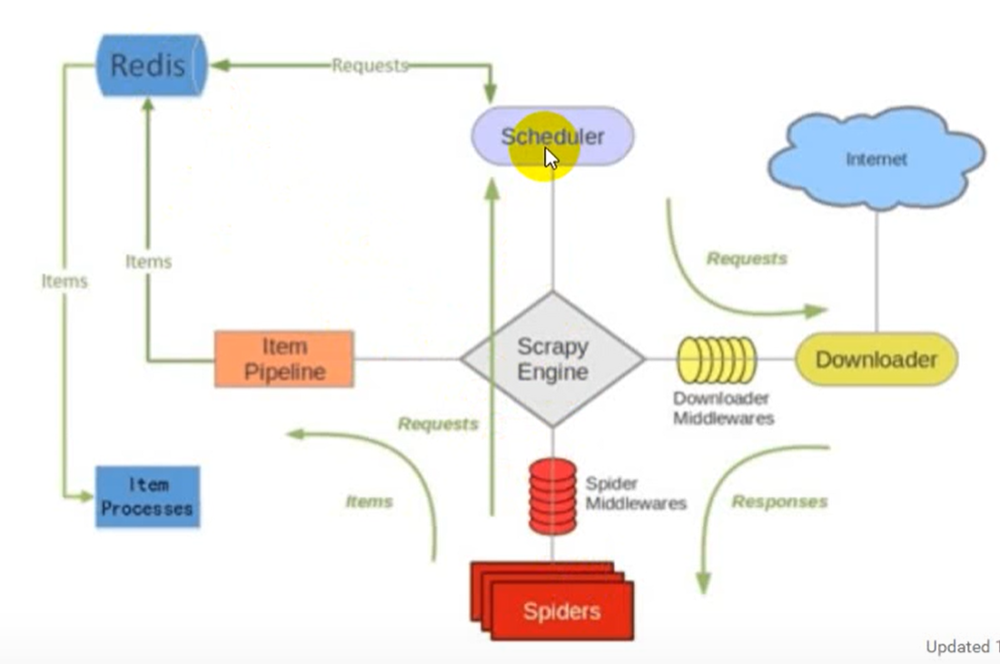

流程不同点:

* 在调度器scheduler发送request请求给下载器前，先将request请求发送给Redis服务器，比较该url是否被爬取，来避免爬取重复的数据
* pipline接收到数据后，将数据发送给Redis,即可把数据存放在同一个地方

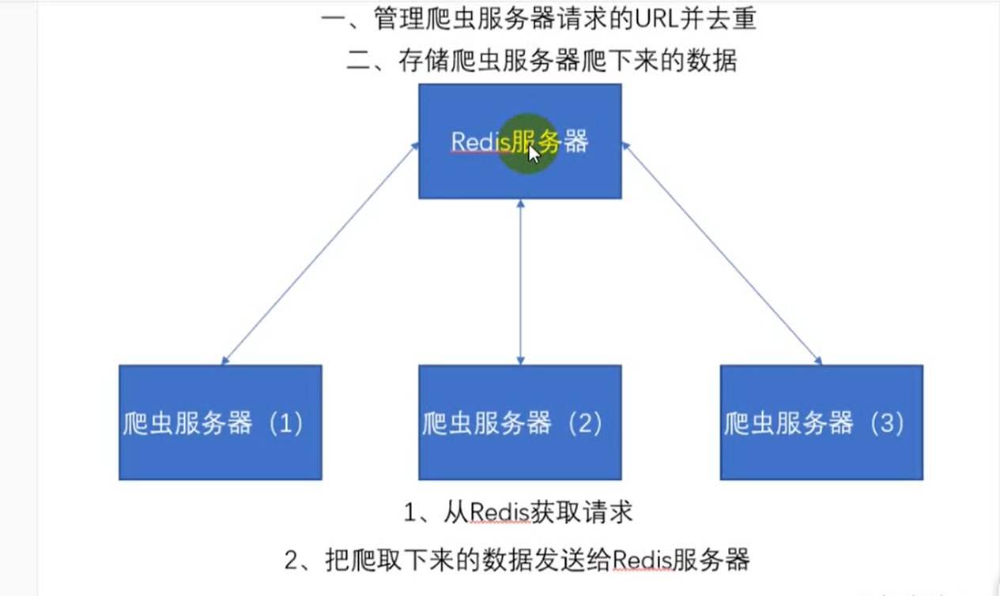

注意：Redis服务器的内存应该足够大，因为数据是存储在Redis的内存中的（虽然也可以同步到磁盘中，但速度较慢），否则将数据存储在Redis的内存中时会数据溢出。

----------------------

#### redis使用场景：
1.登录会话存储：存储在redis中， 与memcached相比， 数据不会丢失。
2.排行版/计数器：比如一些秀场类的项目，经常会有一些前多少名的主播排名。还有文章阅读量的技术，或者新浪微博的点赞
数等。
3.作为消息队列：比如celery就是使用redis作为中间人。
4.当前在线人数：还是之前的秀场例子，会显示当前系统有多少在线人数。
5.一些常用的数据缓存：比如我们的BBS论坛， 板块不会经常变化的， 但是每次访问首页都要从mysql中获取， 可以在red is中缓存起来，不用每次请求数据库。
6.把前200篇文章缓存或者评论缓存：一般用户浏览网站，只会浏览前面一部评论，那么可以把前面200篇文章和对应的缓存起来。用户访问超过的，就访问数据库，并且以后文章超过200篇，则把之前的文章删除。
7.好友关系：微博的好友关系使用redis实现。
8.发布和订阅功能：可以用来做聊天软件。


##### Redis的安装

下载安装包：网址[github微软开源项目](https://github.com/microsoftarchive/redis/releases)

下载完成后双击运行

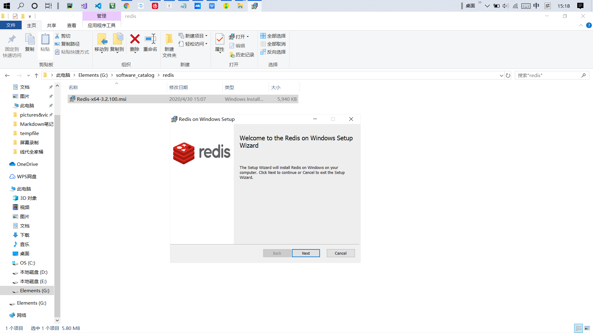


修改安装路径，并添加到环境变量中

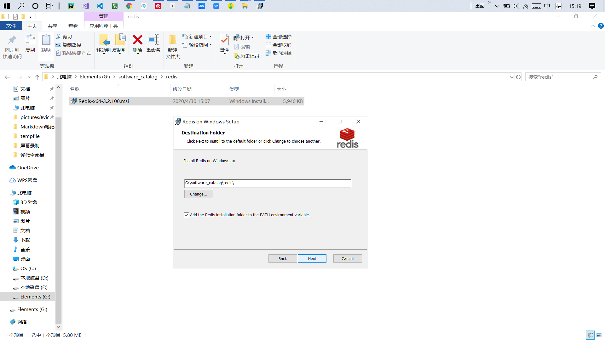


设置防火墙信任的端口号

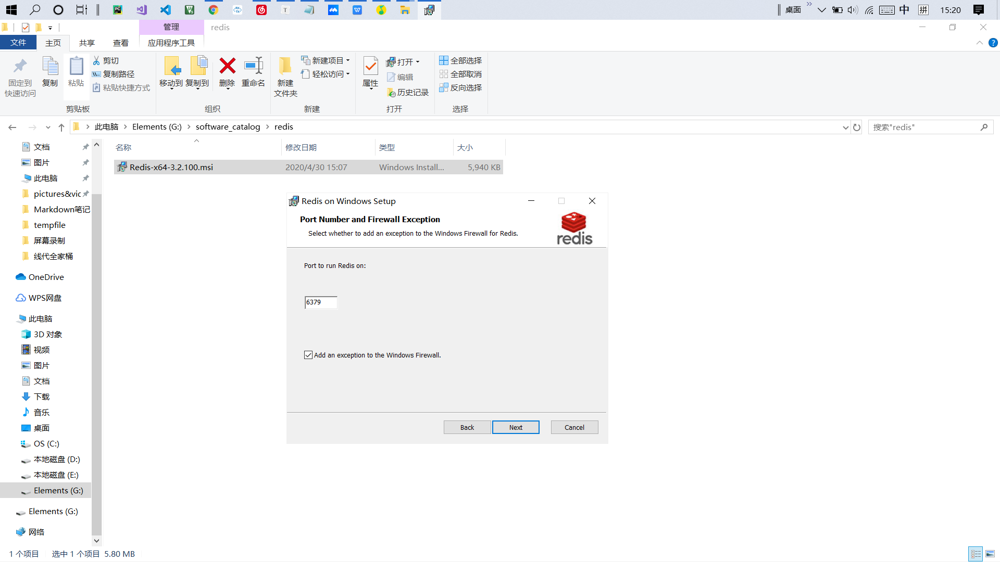


设置内存限制

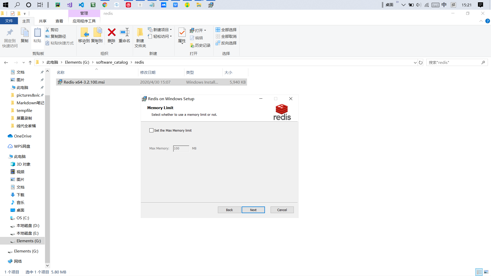


安装完成后的文件

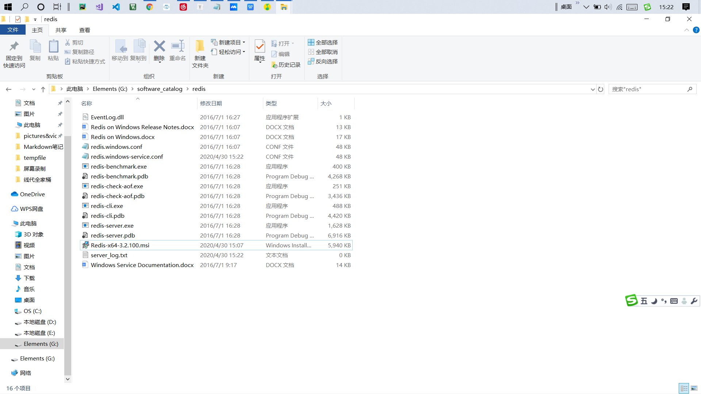

##### 启动redis

启动cmd，定位到在redis的安装目录下，输入指令```redis-server.exe  redis.windows.conf```

##### 连接redis

输入```redis-cli```(前提是redis'已经添加到环境变量中去了)，即可连接到redis服务器。而且redis提供了一个图形化操作界面软件redisdesktopManager

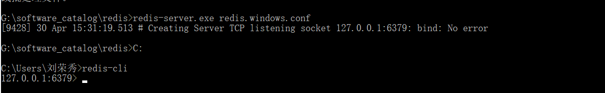

