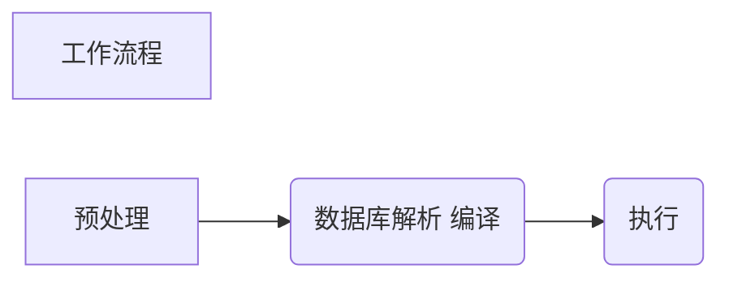

# PHP MYSQL


### 创建php 数据库jiao'suo

1. **连接数据库**

面相*对象*

``` php
<?php
$servername = "localhost";
$username = "username";
$password = "password";

// 创建连接
$conn = new mysqli($servername, $username, $password);

// 检测连接
if ($conn->connect_error) {
  die("Connection failed: " . $conn->connect_error);
}
echo "Connected successfully";
?>
```

使用*wamp*的时候需注意，初始的应户名是；*root* 密码是空白，故创建数据库应该用下列代码

```php   
<?php
$servername = "localhost";
$username = "root";
$password = "";

// 创建连接
$mysqli = new mysqli($servername, $username, $password);

// 检测连接
if ($mysqli->connect_error) {
    die("Connection failed: " . $mysqli->connect_error);
}
echo "Connected successfully";
?>
```

此外还有面向过程及PDO

2. **创建数据库**

使用 $conn->query($sql)函数，函数参数为一个字符串变量，[^字符串中指定要建立一个数据库CREATE DATABASE及数据库的名字]

```php
<?php
$servername = "localhost";
$username = "root";
$password = "";

// 创建连接
$conn = new mysqli($servername, $username, $password);
// 检测连接
if ($conn->connect_error) {
    die("Connection failed: " . $conn->connect_error);
}

// Create database
$sql = "CREATE DATABASE myDBtroye";
if ($conn->query($sql) === TRUE) {
    echo "Database created successfully";
} else {
    echo "Error creating database: " . $conn->error;
}

$conn->close();
?>

```


## 创建数据库表

#### MYSQL数据类型

> TEXT类型

| 数据类型         | 描述                                                         |
| ---------------- | ------------------------------------------------------------ |
| VARCHAR(size)    | 保存可变长度的字符串（可包含字母、数字以及特殊字符）。在括号中指定字符串的最大长度。最多 255 个字符。**注释：**如果值的长度大于 255，则被转换为 TEXT 类型。 |
| MEDIUMTEXT       | 存放最大长度为 16,777,215 个字符的字符串。                   |
| TEXT             | 存放最大长度为 65,535 个字符的字符串。                       |
| ENUM(x,y,z,etc.) | 允许您输入可能值的列表。可以在 ENUM 列表中列出最大 65535 个值。如果列表中不存在插入的值，则插入空值。**注释：**这些值是按照您输入的顺序排序的。可以按照此格式输入可能的值： ENUM('X','Y','Z') |
| LONGTEXT         | 存放最大长度为 4,294,967,295 个字符的字符串。                |
| CHAR(size)       | 保存固定长度的字符串（可包含字母、数字以及特殊字符）。在括号中指定字符串的长度。最多 255 个字符。 |

详见[TEXT数据类型](https://www.w3cschool.cn/mysql/sql-datatypes.html)

> Number类型

| 数据类型      | 描述                                                         |
| ------------- | ------------------------------------------------------------ |
| FLOAT(size,d) | 带有浮动小数点的小数字。在 size 参数中规定最大位数。在 d 参数中规定小数点右侧的最大位数。 |
| BIGINT(size)  | -9223372036854775808 到 9223372036854775807 常规。0 到 18446744073709551615 无符号*。在括号中规定最大位数。 |
| INT(size)     | -2147483648 到 2147483647 常规。0 到 4294967295 无符号*。在括号中规定最大位数。 |
| TINYINT(size) | -128 到 127 常规。0 到 255 无符号*。在括号中规定最大位数。   |

详见[Number数据类型](https://www.w3cschool.cn/mysql/sql-datatypes.html)

> Date数据类型

| 数据类型    | 描述                                                         |
| ----------- | ------------------------------------------------------------ |
| DATETIME()  | 日期和时间的组合。格式：YYYY-MM-DD HH:MM:SS[^RUNOOB]:**注释：**支持的范围是从 '1000-01-01 00:00:00' 到 '9999-12-31 23:59:59' |
| TIMESTAMP() | *时间戳。TIMESTAMP 值使用 Unix 纪元('1970-01-01 00:00:00' UTC) 至今的秒数来存储。格式：YYYY-MM-DD HH:MM:SS    [^RUNOOB]: 注释:支持的范围是从 '1970-01-01 00:00:01' UTC 到 '2038-01-09 03:14:07' UTC |
| TIME()      | 时间。格式：HH:MM:SS [^注释：支持的范围是从 '-838:59:59' 到 '838:59:59'] |
| DATE()      | 日期。格式：YYYY-MM-DD**注释：**支持的范围是从 '1000-01-01' 到 '9999-12-31' |
| YEAR()      | 2 位或 4 位格式的年。**注释：**4 位格式所允许的值：1901 到 2155。2 位格式所允许的值：70 到 69，表示从 1970 到 2069。 |

在设置了数据类型后，你可以为每个列指定其他选项的属性：

* NOT NULL - 每一行都必须含有值（不能为空），null 值是不允许的。

* DEFAULT value - 设置默认值

* UNSIGNED - 使用无符号数值类型，0 及正数

+ AUTO INCREMENT - 设置 MySQL 字段的值在新增记录时每次自动增长 1

+ PRIMARY KEY - 设置数据表中每条记录的唯一标识。 通常列的 PRIMARY KEY 设置为 ID 数值，与AUTO_INCREMENT 一起使用。

每个表都应该有一个**主键**(本列为 "*id*" 列)，主键必须包含唯一的值。


##### 创建数据表的方法[^使用查询语句]

--------------------------

```php
<?php
$servername = "localhost";
$username = "root";
$password = "";
$dbname = "myDB";

// 创建连接
$conn = new mysqli($servername, $username, $password, $dbname);
// 检测连接
if ($conn->connect_error) {
    die("Connection failed: " . $conn->connect_error);
}

// sql to create table
$sql = "CREATE TABLE MyGuests (
id INT(6) UNSIGNED AUTO_INCREMENT PRIMARY KEY,        #id为主列，每个数据表都有一个主列
firstname VARCHAR(30) NOT NULL,                       #必填，一个30字节的char型数据
lastname VARCHAR(30) NOT NULL,
email VARCHAR(50),
reg_date TIMESTAMP
)";

if ($conn->query($sql) === TRUE) {
    echo "Table MyGuests created successfully";
} else {
    echo "Error creating table: " . $conn->error;
}

$conn->close();      //关闭数据库
?>

```

<u> CREATE TABLE  </u>+ 数据表名称


#### 向数据表内插入数据

------------------------

在创建完数据库和表后，我们可以向表中添加数据。

以下为一些语法规则：

- **PHP 中 SQL** 查询语句**必须使用引号**
- **在 SQL 查询语句中的字符串值必须加引号**
- 数值的值不需要引号
- NULL 值不需要引号


使用**查询**语句INSERT INTO

```php
插入语法，同步写出需要插入数据的列及其值
INSERT INTO table_name (column1, column2, column3,...)        
VALUES (value1, value2, value3,...)
```

[^ RUNOOB]

[^RUNOOB]:** 注意：** 如果列设置 AUTO_INCREMENT (如 "id" 列) 或 TIMESTAMP (如 "reg_date" 列),，我们就不需要在 SQL 查询语句中指定值； MySQL 会自动为该列添加值。

```PHP
<?php
$servername = "localhost";
$username = "root";
$password = "";
$dbname = "myDB";

// 创建连接
$conn = new mysqli($servername, $username, $password, $dbname);
// 检测连接
if ($conn->connect_error) {
    die("Connection failed: " . $conn->connect_error);
}

$sql = "INSERT INTO MyGuests (firstname, lastname, email)
VALUES ('John', 'Doe', 'john@example.com')";

if ($conn->query($sql) === TRUE) {
    echo "New record created successfully";
} else {
    echo "Error: " . $sql . "<br>" . $conn->error;
}

$conn->close();
?>
```

如果需要插入多条数据，则应该使用字符串加法即使用方法“.”

```php
<?php
$servername = "localhost";
$username = "root";
$password =
"";
$dbname =
"myDB";

// 创建链接
$conn =
new mysqli($servername, $username, $password, $dbname);

// 检查链接

if ($conn->connect_error) {
die("Connection failed: " . $conn->connect_error);
}


$sql = "INSERT INTO
MyGuests (firstname, lastname, email)

VALUES ('John', 'Doe', 'john@example.com');";

$sql .= "INSERT INTO
MyGuests (firstname, lastname, email)

VALUES ('Mary', 'Moe', 'mary@example.com');";

$sql .= "INSERT INTO
MyGuests (firstname, lastname, email)

VALUES ('Julie', 'Dooley', 'julie@example.com')";


if ($conn->multi_query($sql) === TRUE) {
echo "New
records created successfully";
} else {
echo
"Error: " . $sql . "
" . $conn->error;
}

$conn->close();
?>
```


#### 预处理指令

--------------

**作用：** 1.  防止sql注入

​             2.预处理语句不仅大大减少了需要传输的数据量，还提高了命令的处理效率。

------------------


预处理指令**工作流程**：



[^预处理]: 创建 SQL 语句模板并发送到数据库。预留的值使用参数 "?" 标记 。例如：INSERT INTO MyGuests (firstname, lastname, email) VALUES(?, ?, ?)
[^数据库解析 编译]: 对SQL语句模板执行查询优化，并存储结果不输出 
[^执行]: 最后，将应用绑定的值传递给参数（"?" 标记），数据库执行语句。应用可以多次执行语句，如果参数的值不一样。

```php
<?php
$servername = "localhost";
$username = "root";
$password = "";
$dbname = "myDB";

// 创建连接
$conn = new mysqli($servername, $username, $password, $dbname);

// 检测连接
if ($conn->connect_error) {
    die("Connection failed: " . $conn->connect_error);
}

// prepare and bind
$stmt = $conn->prepare("INSERT INTO MyGuests (firstname, lastname, email) VALUES(?, ?, ?)");
//使用？值代替具体数值，sql预处理，在此我们可以将问号替换为整型，字符串，双精度浮点型和布尔值。 


$stmt->bind_param("sss", $firstname, $lastname, $email);
//三个参数都为s型，即字符型参数，每个参数都要指定参数类型
/*参数类型犹如下四种
i - integer（整型）
d - double（双精度浮点型）
s - string（字符串）
b - BLOB（布尔值）
*/

// 设置参数并执行
$firstname = "John";
$lastname = "Doe";
$email = "john@example.com";
$stmt->execute();

$firstname = "Mary";
$lastname = "Moe";
$email = "mary@example.com";
$stmt->execute();

$firstname = "Julie";
$lastname = "Dooley";
$email = "julie@example.com";
$stmt->execute();

echo "New records created successfully";

$stmt->close();
$conn->close();
?>
```


#### 数据查询

-----

*SELECT* 语句用于从数据表中读取数据

```php
#SELECT使用方法
SELECT column_name(s) FROM table_name
```

从上述创建的数据表 *MyGuests*中获取数据的示例

```php
<?php
$servername = "localhost";
$username = "root";
$password = "";
$dbname = "myDB";

// 创建连接
$conn = new mysqli($servername, $username, $password, $dbname);
// 检测连接
if ($conn->connect_error) {
    die("Connection failed: " . $conn->connect_error);
}

$sql = "SELECT id, firstname, lastname FROM MyGuests";           //输出id fistname lastname 
$result = $conn->query($sql);

if ($result->num_rows > 0) {
    
    // 输出每行数据
    while($row = $result->fetch_assoc()) {
        echo "<br> id: ". $row["id"]. " - Name: ". $row["firstname"]. " " . $row["lastname"];
    }
} else {
    echo "0 results";
}
$conn->close();
?>
```


#### 数据筛选

------------

使用*where*子句即可结合select语句查询想要的数据
```php
SELECT column_name(s)
 FROM table_name
 WHERE column_name operator value
```
*where*子句用于提取满足要求的内容记录

#### 数据排序
ORDER BY 关键词用于对记录集中的数据进行排序。[^注意]：ORDER BY 关键词默认对记录进行升序排序。
如果你想降序排序，请使用 DESC 关键字。
```php
SELECT column_name(s)
 FROM table_name
 ORDER BY column_name(s) ASC|DESC
```
[^ps]: 若想对所有数据进行排序，则可以使用*来选择

 ```php
 <?php
 $con=mysqli_connect("example.com","peter","abc123","my_db");
 // Check connection
 if (mysqli_connect_errno())
 {
 echo "Failed to connect to MySQL: " . mysqli_connect_error();
 }

 $result = mysqli_query($con,"SELECT * FROM Persons ORDER BY age");

 while($row = mysqli_fetch_array($result))
 {
 echo $row['FirstName'];
 echo " " . $row['LastName'];
 echo " " . $row['Age'];
 echo "<br>";
 }

 mysqli_close($con);
 ?>
 ```

 运行结果
 ```运行结果
 troye 33
 sivan 35
 ```

可以对两行进行排序，

```
 SELECT column_name(s)
 FROM table_name
 ORDER BY column1, column2
```

[^注释]: 对于多行排序来说只有前一行相同才使用下一行排序


#### 数据表中的数据更新

--------

<u>UPDATE</u>语句用于中修改数据库表中的数据。

[^ps]:更新的数据必须已经存在于数据表中

```php
#使用的方法
UPDATE table_name
SET column1=value, column2=value2,...
WHERE some_column=some_value
```

[^注意]: where子句指定了需要修改的地方，如果没有where子句指定位置则全部数据都会被更新


假设原本的数据表Persons的内容是这样的

| Firstname | Lastname | age  |
| --------- | -------- | ---- |
| troye     | sivan    | 24   |
| taylor    | swift    | 30   |

```php
<?php
 $con=mysqli_connect("example.com","peter","abc123","my_db");
 // Check connection
 if (mysqli_connect_errno())
 {
 echo "Failed to connect to MySQL: " . mysqli_connect_error();
 }

 mysqli_query($con,"UPDATE Persons SET Age=23
 WHERE FirstName='troye' AND LastName='sivan'");

 mysqli_close($con);
 ?>
```

在数据表执行更新后，数据表变为
| Firstname | Lastname | age  |
| --------- | -------- | ---- |
| troye     | sivan    | 23   |
| taylor    | swift    | 30   |


#### 删除数据表中的数据

-------

使用语句 DELECT FROM

```
DELETE FROM table_name
WHERE some_column = some_value
```

**[^注释]：**请注意 DELETE 语法中的 WHERE 子句。WHERE 子句规定了哪些记录需要删除。如果您想省去 WHERE 子句，所有的记录都会被删除！


