## MYSQL详细参数

MySQL 可应用于多种语言，包括 PERL, C, C++, JAVA 和 PHP。 在这些语言中，Mysql在PHP的web开发中是应用最广泛。

PHP提供了多种方式来访问和操作Mysql数据库记录。PHP **Mysqli**函数格式如下：

```php
mysqli_function(value,value,...);
```

以上格式中 function部分描述了mysql函数的功能，value则是函数的参数

```
mysqli_connect($connect);
mysqli_query($connect,"SQL 语句");
mysqli_fetch_array()
mysqli_close()
```


#### mysql连接

##### 使用MySQL·二进制链接（即使用命令行来操作mysql）

首先按住<kbd>win</kbd>+<kbd>x</kbd>打开windows powerpoll 

将目前文件路径改为mysql的bin目录下

 cd E:\softwarecatalog\wamp\wam\bin\mysql\mysql5.7.24\bin

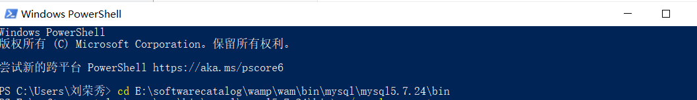

再使用root账户或者其他mysql账户登陆，输入``` ./mysql -u root -p```

并输入密码登陆

登陆成功后显示如图


之后就可以使用sql操作数据库了

例如``` show databases```

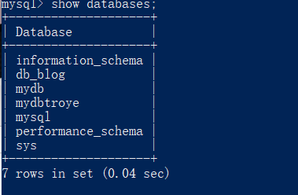

##### 使用php脚本连接
PHP 提供了 mysqli_connect() 函数来连接数据库。
该函数有 6 个参数，在成功链接到 MySQL 后返回连接标识，失败返回 FALSE 。
**参数说明：**
| 参数 | 描述 |
| --- | --- |
| host | 可选，规定主机名或者ip地址 |
| username | 选择mysql用户名 |
| pass ward | 相应mysql用户的密码 |
| dbname | 确定连接的数据库名|
| port | 规定尝试连接到 MySQL 服务器的端口号。|
| socket | 规定 socket 或要使用的已命名 pipe。|

使用mysqli_connect()函数来断开MYSQL数据库的来连接。
该函数只有一个参数为mysqli_connect（）函数创建成功后返回的mysql连接标识符

```php
<?php
$dbhost = 'localhost';  // mysql服务器主机地址
$dbuser = 'root';            // mysql用户名
$dbpass = '123456';          // mysql用户名密码
$conn = mysqli_connect($dbhost, $dbuser, $dbpass);
if(! $conn )
{
    die('Could not connect: ' . mysqli_error());
}
echo '数据库连接成功！';
mysqli_close($conn);
?>
```


#### mysql数据库创建

##### 使用命令行来创建数据库

在登陆MYSQL服务后，使用**create**命令来创建数据库
语法为：
```
CREAT DATABASE 数据库名;
```

例如使用命令行创建一个数据库名为swift


使用root登录后，可以使用

```
CREATE DATABASE IF NOT EXISTS RUNOOB DEFAULT CHARSET utf8 COLLATE utf8_general_ci;
```

创建数据库，该命令的作用：

- 1. 如果数据库不存在则创建，存在则不创建。
- 2. 创建RUNOOB数据库，并设定编码集为utf8


##### 使用php脚本创建数据库

PHP 使用 mysqli_query 函数来创建或者删除 MySQL 数据库。

该函数有两个参数，在执行成功时返回 TRUE，否则返回 FALSE。

使用```mysqli_query(connection, query,resultmode)```

|参数 | 描述 |
|---| ---|
|connection|必需，规定使用的mysql连接|
|query | 必需，规定查询字符|
|resulmode| 可选，可以为                                                                           MYSQLI_USe_RESULT  ( 如果需要检索大量数据，请使用这个） MYSQLI_STORE_RESULT (默认) |

创建一个数据库

```
<?php
$dbhost = 'localhost';  // mysql服务器主机地址
$dbuser = 'root';            // mysql用户名
$dbpass = '';          // mysql用户名密码
$conn = mysqli_connect($dbhost, $dbuser, $dbpass);
if(! $conn )
{
  die('连接错误: ' . mysqli_error($conn));
}
echo '连接成功<br />';
$sql = 'CREATE DATABASE RUNOOB';
$retval = mysqli_query($conn,$sql );
if(! $retval )
{
    die('创建数据库失败: ' . mysqli_error($conn));
}
echo "数据库 article 创建成功\n";
mysqli_close($conn);
?>
```


#### 数据库的删除

使用普通用户登陆 MySQL 服务器，你可能需要特定的权限来创建或者删除 MySQL 数据库，所以我们这边使用 root 用户登录，root 用户拥有最高权限。

在删除数据库过程中，务必要十分谨慎，因为在执行删除命令后，所有数据将会消失。

**方法一**： 在登陆root账户后使用drop删除数据库

```
mysql> drop database swift 
```

*前提*： 该数据库必须已经存在

**方法二：** 使用mysqladmin删除数据库


将文件目录定位到mysqladmin.exe时，使用命令行    ./mysqladmin -u root -p drop 数据库名


**方法三：** 使用php脚本删除数据库

使用函数mysqli_query()

| 参数         | 描述                                                         |
| :----------- | :----------------------------------------------------------- |
| *connection* | 必需。规定要使用的 MySQL 连接。                              |
| *query*      | 必需，规定查询字符串。                                       |
| *resultmode* | 可选。一个常量。可以是下列值中的任意一个：MYSQLI_USE_RESULT（如果需要检索大量数据，请使用这个）MYSQLI_STORE_RESULT（默认） |

```php
<?php
$dbhost = 'localhost:3306';  // mysql服务器主机地址
$dbuser = 'root';            // mysql用户名
$dbpass = '';          // mysql用户名密码

$conn = mysqli_connect($dbhost, $dbuser, $dbpass);
if(! $conn )
{
    die('连接失败: ' . mysqli_error($conn));
}
echo '连接成功<br />';
$sql = 'DROP DATABASE RUNOOB';
$retval = mysqli_query( $conn, $sql );
if(! $retval )
{
    die('删除数据库失败: ' . mysqli_error($conn));
}
echo "数据库 swift 删除成功\n";
mysqli_close($conn);
?>
```

**注意：** 在使用PHP脚本删除数据库时，不会出现确认是否删除信息，会直接删除指定数据库，所以你在删除数据库时要特别小心


#### mysql 选择数据库

##### 从命令提示窗口选择数据库

使用 ``` use 数据库名```

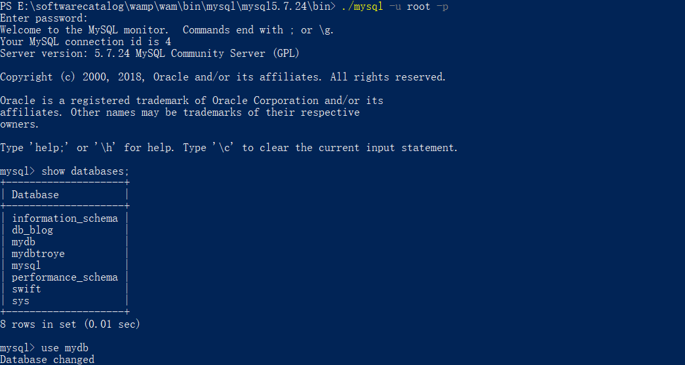

执行以上命令后，你就已经成功选择了 RUNOOB 数据库，在后续的操作中都会在 RUNOOB 数据库中执行。

**注意:**所有的数据库名，表名，表字段都是区分大小写的。所以你在使用SQL命令时需要输入正确的名称。


##### 使用php脚本选择mysql数据库

PHP 提供了函数 mysqli_select_db 来选取一个数据库。函数在执行成功后返回 TRUE ，否则返回 FALSE 。

### 语法

```
mysqli_select_db(connection,dbname);
```

| 参数         | 描述                            |
| :----------- | :------------------------------ |
| *connection* | 必需。规定要使用的 MySQL 连接。 |
| *dbname*     | 必需，规定要使用的默认数据库。  |

以下实例展示了如何使用 mysqli_select_db 函数来选取一个数据库：

 **选择数据库**
 ```php
<?php
$dbhost = 'localhost:3306';  // mysql服务器主机地址
$dbuser = 'root';            // mysql用户名
$dbpass = '123456';          // mysql用户名密码
$conn = mysqli_connect($dbhost, $dbuser, $dbpass);
if(! $conn )
{
    die('连接失败: ' . mysqli_error($conn));
}
echo '连接成功';
mysqli_select_db($conn, 'RUNOOB' );
mysqli_close($conn);
?>
 ```


#### MYSQL创建数据表

一个完整地数据表需要包括以下信息：

+ 表名
+ 表字段名
+ 定义每个表字段

创建一个数据表的语法为```CREATE TABLE table_name (column_name column_type);```


##### 通过命令提示符创建数据表

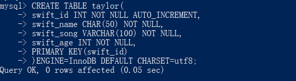

- 如果你不想字段为 **NULL** 可以设置字段的属性为 **NOT NULL**， 在操作数据库时如果输入该字段的数据为**NULL** ，就会报错。
- AUTO_INCREMENT定义列为自增的属性，一般用于主键，数值会自动加1。
- PRIMARY KEY关键字用于定义列为主键。 您可以使用多列来定义主键，列间以逗号分隔。
- ENGINE 设置存储引擎，CHARSET 设置编码。


ps：**注意：**MySQL命令终止符为分号 **;** 。

​        **注意：** **->** 是换行符标识，不要复制。


##### 使用php脚本创建数据表

使用```mysqli_query()```函数来创建已存在数据库的数据表

```php
<?php
$dbhost = 'localhost:3306';  // mysql服务器主机地址
$dbuser = 'root';            // mysql用户名
$dbpass = '';          // mysql用户名密码
$conn = mysqli_connect($dbhost, $dbuser, $dbpass);
if(! $conn )
{
    die('连接失败: ' . mysqli_error($conn));
}
echo '连接成功<br />';
$sql = "CREATE TABLE runoob_tbl( ".
        "runoob_id INT NOT NULL AUTO_INCREMENT, ".
        "runoob_title VARCHAR(100) NOT NULL, ".
        "runoob_author VARCHAR(40) NOT NULL, ".
        "submission_date DATE, ".
        "PRIMARY KEY ( runoob_id ))ENGINE=InnoDB DEFAULT CHARSET=utf8; ";
mysqli_select_db( $conn, 'RUNOOB' );
$retval = mysqli_query( $conn, $sql );
if(! $retval )
{
    die('数据表创建失败: ' . mysqli_error($conn));
}
echo "数据表创建成功\n";
mysqli_close($conn);
?>
```


##### 查看创建好的数据表

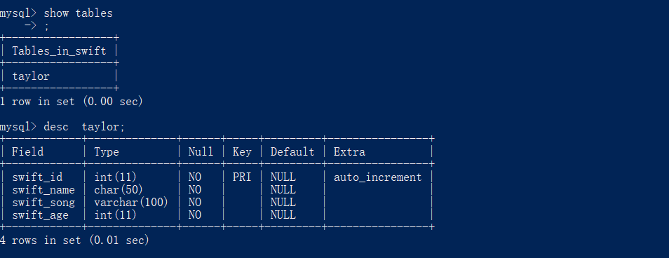


#### 插入数据

当创建好一个数据表时需要给其插入数据才能使使用

使用INSERT INTO SQL语句来插入数据

当数据是字符显示必须使用单引号或者双引号

##### 使用命令提示窗口插入：


**注意：** 使用箭头标记 **->** 不是 SQL 语句的一部分，它仅仅表示一个新行，如果一条SQL语句太长，我们可以通过回车键来创建一个新行来编写 SQL 语句，SQL 语句的命令结束符为分号 **;**。


##### 使用php脚本插入

使用函数mysqli_query()来执行命令INSERT　INTO

 ```php
<?php
$dbhost = 'localhost:3306';  // mysql服务器主机地址
$dbuser = 'root';            // mysql用户名
$dbpass = '123456';          // mysql用户名密码
$conn = mysqli_connect($dbhost, $dbuser, $dbpass);
if(! $conn )
{
  die('连接失败: ' . mysqli_error($conn));
}
echo '连接成功<br />';
// 设置编码，防止中文乱码
mysqli_query($conn , "set names utf8");
 
$runoob_title = '学习 Python';
$runoob_author = 'RUNOOB.COM';
$submission_date = '2016-03-06';
 
$sql = "INSERT INTO runoob_tbl ".
        "(runoob_title,runoob_author, submission_date) ".
        "VALUES ".
        "('$runoob_title','$runoob_author','$submission_date')";
 
 
 
mysqli_select_db( $conn, 'RUNOOB' );
$retval = mysqli_query( $conn, $sql );
if(! $retval )
{
  die('无法插入数据: ' . mysqli_error($conn));
}
echo "数据插入成功\n";
mysqli_close($conn);
?>
 ```

若在第12行未使用```set names utf8```则再插入数据有中文在字符时会出现乱码

如下图：

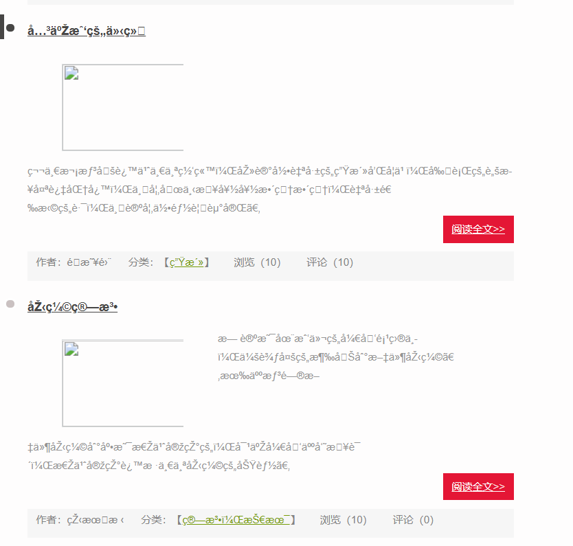

原因是创建数据库时未使用set names utf8

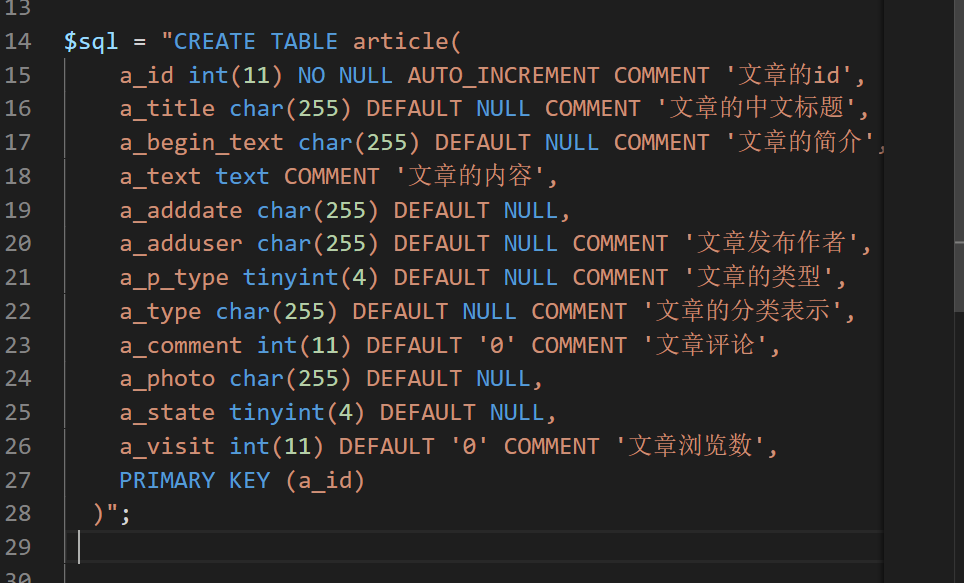


**INSERT 插入多条数据**

```
INSERT INTO table_name  (field1, field2,...fieldN)  VALUES  (valueA1,valueA2,...valueAN),(valueB1,valueB2,...valueBN),(valueC1,valueC2,...valueCN)......;
```


#### MYSQL插查询数据

通过sql SELECT语句查询数据

**语法**

```sql
SELECT column_name,column_name
FROM table_name
[WHERE Clause]
[LIMIT N][OFFSET M]
```

- 查询语句中你可以使用一个或者多个表，表之间使用逗号(,)分割，并使用WHERE语句来设定查询条件。
- SELECT 命令可以读取一条或者多条记录。
- 你可以使用星号（*）来代替其他字段，SELECT语句会返回表的所有字段数据
- 你可以使用 WHERE 语句来包含任何条件。
- 你可以使用 LIMIT 属性来设定返回的记录数。
- 你可以通过OFFSET指定SELECT语句开始查询的数据偏移量。默认情况下偏移量为0。


##### 使用命令提示符获取数据

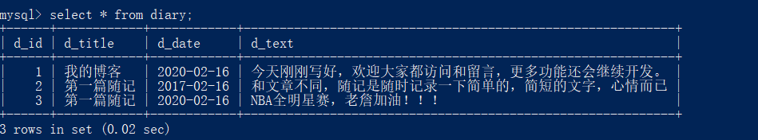


##### 使用php脚本

使用 PHP 函数的``` mysqli_query()``` 及```SQL SELECT``` 命令来获取数据。

该函数用于执行 SQL 命令，然后通过 PHP 函数 ```mysqli_fetch_array()``` 来使用或输出所有查询的数据。

```mysqli_fetch_array()*``` 函数从结果集中取得一行作为关联数组，或数字数组，或二者兼有 返回根据从结果集取得的行生成的数组，如果没有更多行则返回 false。


#### 使用where子句有条件查询


- 查询语句中你可以使用一个或者多个表，表之间使用逗号**,** 分割，并使用WHERE语句来设定查询条件。
- 你可以在 WHERE 子句中指定任何条件。
- 你可以使用 AND 或者 OR 指定一个或多个条件。
- WHERE 子句也可以运用于 SQL 的 DELETE 或者 UPDATE 命令。
- WHERE 子句类似于程序语言中的 if 条件，根据 MySQL 表中的字段值来读取指定的数据。

使用php脚本

```
<?php
$dbhost = 'localhost:3306';  // mysql服务器主机地址
$dbuser = 'root';            // mysql用户名
$dbpass = '123456';          // mysql用户名密码
$conn = mysqli_connect($dbhost, $dbuser, $dbpass);
if(! $conn )
{
    die('连接失败: ' . mysqli_error($conn));
}
// 设置编码，防止中文乱码
mysqli_query($conn , "set names utf8");
 
// 读取 runoob_author 为 RUNOOB.COM 的数据
$sql = 'SELECT runoob_id, runoob_title, 
        runoob_author, submission_date
        FROM runoob_tbl
        WHERE runoob_author="RUNOOB.COM"';
 
mysqli_select_db( $conn, 'RUNOOB' );
$retval = mysqli_query( $conn, $sql );
if(! $retval )
{
    die('无法读取数据: ' . mysqli_error($conn));
}
echo '<h2>菜鸟教程 MySQL WHERE 子句测试<h2>';
echo '<table border="1"><tr><td>教程 ID</td><td>标题</td><td>作者</td><td>提交日期</td></tr>';
while($row = mysqli_fetch_array($retval, MYSQLI_ASSOC))
{
    echo "<tr><td> {$row['runoob_id']}</td> ".
         "<td>{$row['runoob_title']} </td> ".
         "<td>{$row['runoob_author']} </td> ".
         "<td>{$row['submission_date']} </td> ".
         "</tr>";
}
echo '</table>';
// 释放内存
mysqli_free_result($retval);
mysqli_close($conn);
?>
```


#### MYSQL UPDATE 更新

修改MYSQL数据库中的数据，使用SQL UPDATE命令操作

```
UPDATE table_name SET field1=new-value1, field2=new-value2
[WHERE Clause]
```

- 你可以同时更新一个或多个字段。
- 你可以在 WHERE 子句中指定任何条件。
- 你可以在一个单独表中同时更新数据。


#### MYSQL模糊搜索，使用LIKE

当找到需要查询的准确数据时，则使用where = ""来获取数据

但当只知道部分信息时，如知道名字的部分字母。则应使用模糊搜索，在WHERE 子句中使用SQL LIKE 子句

SQL LIKE 子句中使用百分号 **%**字符来表示任意字符，类似于UNIX或正则表达式中的星号 *****。

如果没有使用百分号 **%**, LIKE 子句与等号 **=** 的效果是一样的

以下是 SQL SELECT 语句使用 LIKE 子句从数据表中读取数据的通用语法：

```
SELECT field1, field2,...fieldN 
FROM table_name
WHERE field1 LIKE condition1 [AND [OR]] filed2 = 'somevalue'
```

- 你可以在 WHERE 子句中指定任何条件。
- 你可以在 WHERE 子句中使用LIKE子句。
- 你可以使用LIKE子句代替等号 **=**。
- LIKE 通常与 **%** 一同使用，类似于一个元字符的搜索。
- 你可以使用 AND 或者 OR 指定一个或多个条件。
- 你可以在 DELETE 或 UPDATE 命令中使用 WHERE...LIKE 子句来指定条件。


##### 在命令提示符中使用LIKE子句

数据库中所有数据

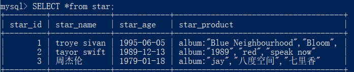

搜索star_product中含有album的行

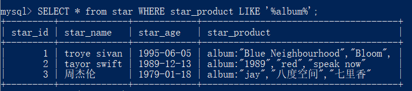

搜索star——name中以t结尾的行

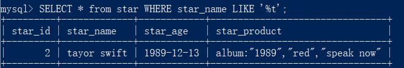

搜索star_name中含有t的行

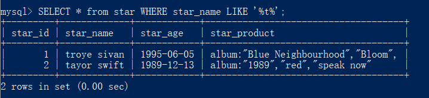

搜索star_name中以t开头的行

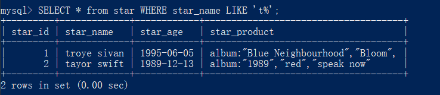


like 匹配/模糊匹配，会与 **%** 和 **_** 结合使用。

```
'%a'     //以a结尾的数据
'a%'     //以a开头的数据
'%a%'    //含有a的数据
'_a_'    //三位且中间字母是a的
'_a'     //两位且结尾字母是a的
'a_'     //两位且开头字母是a的
```


##### 使用php脚本使用LIKE子句

```
<?php
$dbhost = 'localhost:3306';  // mysql服务器主机地址
$dbuser = 'root';            // mysql用户名
$dbpass = '';          // mysql用户名密码
$conn = mysqli_connect($dbhost, $dbuser, $dbpass);
if(! $conn )
{
    die('连接失败: ' . mysqli_error($conn));
}
// 设置编码，防止中文乱码
mysqli_query($conn , "set names utf8");
 
$sql = 'SELECT runoob_id, runoob_title, 
        runoob_author, submission_date
        FROM runoob_tbl
        WHERE runoob_author LIKE "%COM"';
 
mysqli_select_db( $conn, 'RUNOOB' );
$retval = mysqli_query( $conn, $sql );
if(! $retval )
{
    die('无法读取数据: ' . mysqli_error($conn));
}
echo '<h2>菜鸟教程 mysqli_fetch_array 测试<h2>';
echo '<table border="1"><tr><td>教程 ID</td><td>标题</td><td>作者</td><td>提交日期</td></tr>';
while($row = mysqli_fetch_array($retval, MYSQLI_ASSOC))
{
    echo "<tr><td> {$row['runoob_id']}</td> ".
         "<td>{$row['runoob_title']} </td> ".
         "<td>{$row['runoob_author']} </td> ".
         "<td>{$row['submission_date']} </td> ".
         "</tr>";
}
echo '</table>';
mysqli_close($conn);
?>
```


#### UNION语句

**UNION 语句**：用于将不同表中相同列中查询的数据展示出来；（不包括重复数据）

**UNION ALL 语句**：用于将不同表中相同列中查询的数据展示出来；（包括重复数据）

使用形式如下：

```
SELECT 列名称 FROM 表名称 UNION SELECT 列名称 FROM 表名称 ORDER BY 列名称；
SELECT 列名称 FROM 表名称 UNION ALL SELECT 列名称 FROM 表名称 ORDER BY 列名称；
```


#### MySQL 排序

我们知道从 MySQL 表中使用 SQL SELECT 语句来读取数据。

如果我们需要对读取的数据进行排序，我们就可以使用 MySQL 的 **ORDER BY** 子句来设定你想按哪个字段哪种方式来进行排序，再返回搜索结果。

##### 语法

以下是 SQL SELECT 语句使用 ORDER BY 子句将查询数据排序后再返回数据：

```
SELECT field1, field2,...fieldN FROM table_name1, table_name2...
ORDER BY field1 [ASC [DESC][默认 ASC]], [field2...] [ASC [DESC][默认 ASC]]
```

- 你可以使用任何字段来作为排序的条件，从而返回排序后的查询结果。
- 你可以设定多个字段来排序。
- 你可以使用 ASC 或 DESC 关键字来设置查询结果是按升序或降序排列。 默认情况下，它是按升序排列。
- 你可以添加 WHERE...LIKE 子句来设置条件。

------

##### 在命令提示符中使用 ORDER BY 子句

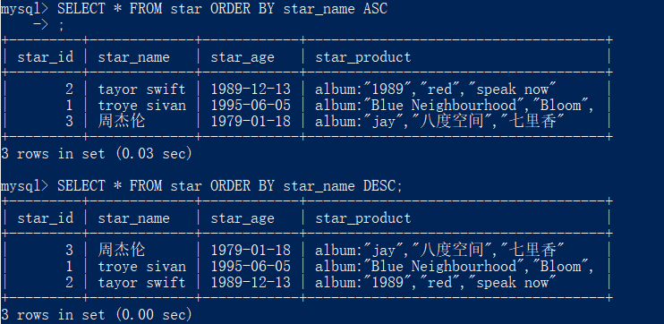